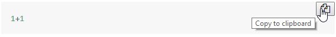
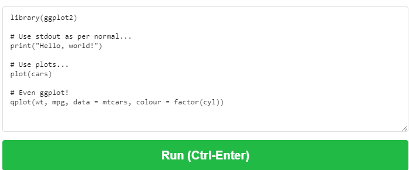
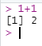
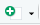

--- 
title: "R Module 1"
author: 
  - "Alex Fout^[Department of Statistics, Colorado State University, fout@colostate.edu]"
  - "Lane Drew^[Department of Statistics, Colorado State University, lane.drew@colostate.edu]"
date: "`r format(Sys.time(), '%d %h, %Y, %I:%M %p')`"
description: This is the book for the R Intro Course at CSU.
link-citations: yes
bibliography:
- src/book.bib
site: bookdown::bookdown_site
biblio-style: apalike
---


# Welcome!

```{r, knitr_options, echo=FALSE, results='hide', message=FALSE}
# fig.align="center"  centers figures
# comment=NA          remove "##" from R output
# results="hold"      don't interleave chunk code and output, but hold all output until end of chunk.
# class.source="chunk-style"     Use the CSS style "chunk-style" to style code chunks
# class.output="output-style"    Use the CSS style "output-style" to style output of code chunks
knitr::opts_chunk$set(fig.align="center", comment=NA, results="hold", class.source="chunk-style", class.output="output-style")

knitr::knit_hooks$set(
  error = function(x, options){
    paste0('\n<pre class="sourceCode r error-style"><code>', x, '</code></pre>')
  }
)

# A recent change in RMarkdown required this change. 


library(kableExtra)
library(lubridate)
start_date <- ymd("2023/06/12")
# designed as a four week course that "meets" 3 times per week.
# course_dates <- start_date + sort(as.vector(outer(c(0, 2, 4), c(0, 7, 14, 21), "+")))
course_dates <- start_date + weeks(0:4) 

r_version <- "4.3.0"
```

Hi, and welcome to the R Module 1 (AKA STAT 158) course at Colorado State University!

This course is the first of three 1 credit courses intended to introduce the R programming language to those with little or no programming experience.

Through these Modules (courses), we'll explore how R can be used to do the following:

1. Perform basic computations and logic, just like any other programming language
1. Load, clean, analyze, and visualize data
1. Run scripts
1. Create reproducible reports so you can explain your work in a narrative form

In addition, you'll also be exposed to some aspects of the broader R community, including:

1. R as free, open source software
1. The free RStudio IDE
1. Publicly available packages which extend the capability of R
1. Events and community groups which advocate for the use of R and the support of R users

More detail will be provided in the Course Topics laid out in the next chapter.

### How To Navigate This Book

To move quickly to different portions of the book, click on the appropriate chapter or section in the the table of contents on the left.
The buttons at the top of the page allow you to show/hide the table of contents, search the book, change font settings, download a pdf or ebook copy of this book, or get hints on various sections of the book.
The faint left and right arrows at the sides of each page (or bottom of the page if it's narrow enough) allow you to step to the next/previous section.
Here's what they look like:
```{r, echo=F, fig.cap="Left and right navigation arrows", fig.show="hold", results='asis'}
knitr::include_graphics("src/images/left_arrow.png")

```

## Associated CSU Course

This bookdown book is intended to accompany the associated course at Colorado State University, but the curriculum is free for anyone to access and use.
If you're reading the PDF or EPUB version of this book, you can find the "live" version at [https://csu-r.github.io/Module1/](https://csu-r.github.io/Module1/), and all of the source files for this book can be found at [https://github.com/CSU-R/Module1](https://github.com/CSU-R/Module1).

If you're not taking the CSU course, you will periodically encounter instructions and references which are not relevant to you. For example, we will make reference to the Canvas website, which only CSU students enrolled in the course have access to.


<!--chapter:end:index.Rmd-->

# Course Preliminaries {#prelim}

> "Learning to code is useful no matter what your career ambitions are." —Arianna Huffington, Founder, The Huffington Post

In this chapter, we'll discuss the preliminary details of the course.
Then you'll run some R code and learn more about R and the R community.

## This Textbook

This course is presented as a [bookdown](https://bookdown.org/) document, and is divided into chapters and sections.
Each week, you'll be expected to read through the chapter and complete any associated exercises, quizzes, or assignments.

### Special Boxes

Throughout the book, you'll encounter special boxes, each with a special meaning.
Here is an example of each type of box:


```{block, type='reflect'}
This box will prompt you to pause and reflect on your experience and/or learning. No feedback will be given, but this may be graded on completion.
```

```{block, type='assessment'}
This box will signify a quiz or assignment which you will turn in for grading, on which the instructor will provide feedback.
```

```{block, type='progress'}
This box is for checking your understanding, to make sure you are ready for what follows.
```

```{block, type='video'}
This box is for displaying/linking to videos in order to help illustrate or communicate concepts.
```

```{block, type='caution'}
This box will warn you of possible problems or pitfalls you may encounter! 
```

```{block, type='bonus'}
This box is to provide material going beyond the main course content, or material which will be revisited later in more depth.
```

```{block, type='feedback'}
This box will prompt for your feedback on the organization of the course, so we can improve the material for everyone!

Any of the boxes may include hyperlinks like this: [I am a link](https://www.r-graph-gallery.com/) or code like this `This is code`.
```

### How This Book Displays Code

In addition, you may see R code either as part of a sentence like this: `1+1`, or as a separate block like so:
```{r, example_codeblock}
1+1
```

Sometimes (as in this example) we will also show the __output__ (in yellow), that is, the result of running the R code. In this case the code `1+1` produced the output `2`.
If you hover over a code block with your mouse, you will see the option to copy the code to your clipboard, like this:
```{r, fig.cap="copying code from this book", echo=F}

```
This will be useful when you are asked to run code on your computer.

### Next Steps

When you're ready, go to the next section to learn about the course syllabus and grading policies.


```{block, type='feedback'}
Any feedback for this section? Click [here](https://docs.google.com/forms/d/e/1FAIpQLSePQZ3lIaCIPo9J2owXImHZ_9wBEgTo21A0s-A1ty28u4yfvw/viewform?entry.1684471501=Course%20Preliminaries)
```

## Course Topics \& Syllabus

Broadly speaking, the topics of this course are described by the Chapter Titles. Here's what each entails:

- Course Preliminaries: Introduction to R and the world of R
- Installing R: Like it sounds, setting up your computer so you can work with R.
- R Programming Fundamentals: The basics of programming in R, the building blocks that you need in order to do anything more interesting.
- Working with Data: How to do meaningful things with data sets. Probably the most useful Chapter of the book.
- Creating R Programs: More programming concepts to increase your R Power!

### Syllabus

First, some important details:

- __Instructor__: [Lane Drew](mailto:lane.drew@colostate.edu)

- __Office Hours__: Held in the Statistics Success Center (Weber 223A), schedule available on Canvas.

- __Webpages__: [Canvas](https://canvas.colostate.edu), [this textbook](https://csu-r.github.io/Module1/)

- __Course Credits__: 1. This means ~1 hours of lecture and 4 hours of work outside of lecture per week.

- __Textbook__: You're reading it right now. The textbook will be your primary learning resource. You'll be expected to read through the required sections, watch any relevant videos, and complete any reflections, progress checks, and assessments along the way. On days when a quiz is due, you should complete the reading _before_ you take the quiz.

- __Prerequisites__: None

- __Assignments/What-to-turn-in__: This course will be graded on three types of assignments: Progress Checks, Homeworks, and Quizzes. There will be four of each. Most weeks, you will have one of these three types of assignments due. Due dates will be specified on Canvas and assignments will be due at 11:59pm on the indicated day (please see schedule below).

- __Progress Checks__: As you work your way through the textbook, you'll encounter purple "Progress Check" boxes. For the first Progress Check, you'll submit your responses directly to canvas. For Progress Checks 2-4, you'll fill in an R Markdown document and submit it to canvas. You'll be provided a template to fill in as you complete the progress checks. To turn in the document, you'll **knit** the document to HTML or PDF and upload to Canvas. (More details coming later in the book!). Progress checks will be graded on completion, organization, and correctness. Progress Checks must be turned in by 11:59pm (Mountain) on the day they are due. Half credit will be given for a two-day window after the due date, after which no credit will be possible.

- __Homework__: There are four homeworks during the semester. You'll complete each homework using R. Homeworks must be turned in by 11:59pm (Mountain) on the day they are due. Half credit will be given for a two-day window after the due date, after which no credit will be possible.

- __Quizzes__: There will be four 15 minute Canvas quizzes during the semester. Quizzes must be completed by 11:59pm (Mountain) on the day they are due. __There are NO late quizzes accepted after the due date has passed. If you cannot complete the quiz on the day it is due, you are expected to do it early__.

- __Exams__: There will be no exams in this course

- __Lectures__: Lectures will be held on Fridays. There will be _mini-lectures_, approximately 10-30 minutes. The mini-lectures will be based on previously read material, no new material will be presented. Students are expected to have read the material before the lecture. The reminder of the time will be _student-led_. We will cover questions students may have or work on homework together.

- __Grading__: The grading for the course is apportioned like so:

  - Progress Checks: 30%
  - Homework: 40%
  - Quizzes: 30%

<!-- ### Schedule -->

<!-- ```{r, schedule, echo=F} -->
<!-- # Summer Schedule -->
<!-- # sched <- data.frame( -->
<!-- #   Week = 1 + isoweek(course_dates) - isoweek(start_date), -->
<!-- #   Weekday = wday(course_dates, label=T, abbr=F), -->
<!-- #   Date = format(course_dates, "%B %d"), -->
<!-- #   Reading = c("1, 2", "3", "4.1, 4.2", "4.3", "4.4, 4.5", "5.1, 5.2", "5.3, 5.4", "5.5, 5.6", "5.7", "6.1", "6.2, 6.3", "6.4"), -->
<!-- #   Due= c("Progress Check 1", "Quiz 1", "Assignment 1", "Progress Check 2", "Quiz 2", "Assignment 2", "Progress Check 3", "Quiz 3", "Assignment 3", "Progress Check 4", "Quiz 4", "Assignment 4") -->
<!-- # ) -->

<!-- # Spring Schedule -->
<!-- sched <- data.frame( -->
<!--   Week = 1 + isoweek(course_dates) - isoweek(start_date), -->
<!--   Weekday = wday(course_dates, label=T, abbr=F), -->
<!--   Date = format(course_dates, "%B %d"), -->
<!--   Reading = c("1", "2", "3.1, 3.2, 3.3", "3.4, 3.5", "4.1, 4.2", "4.3", "4.4", "5.1, 5.2","", "5.3, 5.4", "5.5, 5.6", "5.7", "6.1", "6.2", "6.3", "6.4"), -->
<!--   Due= c("", "Progress Check 1", "", "Quiz 1", "Homework 1", "Progress Check 2", "Quiz 2", "Homework 2", "", "Progress Check 3", "Quiz 3", "Homework 3", "Progress Check 4", "", "Quiz 4", "Homework 4") -->
<!-- ) -->

<!-- knitr::kable(sched) %>% kable_styling() -->
<!-- ``` -->

### Assignment Templates

In order to complete the progress checks and course assignments, you'll need to start from these templates:

Progress Checks

- (Progress Check 1 will not require a template)
- [Progress Check 2](assignment_templates/progress_check_2.rmd)
- [Progress Check 3](assignment_templates/progress_check_3.rmd)
- [Progress Check 4](assignment_templates/progress_check_4.rmd)

Assignments

- [Homework 1](assignment_templates/assignment_1.rmd)
- [Homework 2](assignment_templates/assignment_2.rmd)
- [Homework 3](assignment_templates/assignment_3.rmd)
- [Homework 4](assignment_templates/assignment_4.rmd)


### Course Policies 

- __Late Work__: Homework and Progress Checks must be turned in on time to receive full credit. You may turn in Homework and Progress Checks up to 2 days late for up to 50% credit.
- __Group Work__: Students are welcome to discuss the course with each other, but all work you turn in must be your own. This means no sharing solutions to homework, progress checks, or quizzes. You may not work with other students on quizzes. You _are_ welcome to seek help on Canvas discussion boards and during office hours.
- __Students with Disabilities__: The university is committed to providing support for students with disabilities. If you have an accommodation plan, please provide that to me as soon as possible so we can discuss appropriate arrangements.
- __Growth Mindset__: This phrase was coined by Carol Dweck to reflect how your learning outcomes can be affected by the way you view the learning process. To quote Dweck: "The view you adopt for yourself profoundly affects the way you lead your life... Believing that your qualities are carved in stone - _the fixed mindset_ - creates an urgency to prove yourself over and over. If you have only a certain amount of intelligence, a certain personality, and a certain moral character — well, then you’d better prove that you have a healthy dose of them. It simply wouldn’t do to look or feel deficient in these most basic characteristics... There’s another mindset in which these traits are not simply a hand you’re dealt and have to live with, always trying to convince yourself and others that you have a royal flush when you’re secretly worried it’s a pair of tens. In this mindset, the hand you’re dealt is just the starting point for development. This growth mindset is based on the belief that your basic qualities are things you can cultivate through your efforts. Although people may differ in every which way — in their initial talents and aptitudes, interests, or temperaments — everyone can change and grow through application and experience." Programming may be a very new, intimidating thing for you. That's okay! View this course as a way to grow and gain new skills which you can use to do incredible and important things!
- __Learn by doing__: [A wise statistics instructor](https://statistics.colostate.edu/person/?id=B0D2F899C79C05AAE4EDBA6EE2FECACA&sq=t) once compared watching someone else solve statistics problems to watching someone else practice shooting basketball free throws. You may learn a little by watching, but at some point you won't get any better until you try it yourself! The same can be said for programming. Reading a textbook and watching videos are a good _start_, but you'll have to actually _program_ in order to get any better! This textbook was designed to be _interactive_, and I encourage you to "code along with the book" as you read.

### Grading Scale

Grades will be assigned according to the following scale:

```{r, grading_scale, echo=F}
grading_scale <- data.frame(
  `Class Score` = c("92%-100%", "90%-92%", "88%-90%", "82%-88%", "80%-82%", "78%-80%", "70%-78%", "60%-70%", "0%-60%"),
  `Letter Grade` = c("A", "A-", "B+", "B", "B-", "C+", "C", "D", "F")
)
knitr::kable(grading_scale) %>% kable_styling()
```


```{block, type='feedback'}
Any feedback for this section? Click [here](https://docs.google.com/forms/d/e/1FAIpQLSePQZ3lIaCIPo9J2owXImHZ_9wBEgTo21A0s-A1ty28u4yfvw/viewform?entry.1684471501=Course%20Topics%20%26%20Syllabus)
```

## Running your first R Code

Enough of the boring stuff, let's run some R code!
Normally you will run R on your computer, but since you may not have R installed yet, let's run some R code using a website first.
As you run code, you'll see some of the things R can do.
In a browser, navigate to [rdrr.io/snippets](https://rdrr.io/snippets/){target="_blank"}, where you'll see a box that looks like this:

```{r, fig.cap="rdrr code entry box", echo=F}

```

The box comes with some code entered already, but we want to use our own code instead, so delete all the text, from before `library(ggplot2)` to after `factor(cyl))`.
In its place, type `1+1`, then click the big green "Run" button.
You should see the `[1] 2` displayed below.
So if you give R a math expression, it will evaluate it and give the result.
Note: the "correct answer" to $1+1$ is `2`, but the output also displays `[1]`, which we won't explain until later, so you can ignore that for now.

Next, delete the code you just wrote and type (or copy/paste) the following, and run it:
```{r, eval=F}
factorial(10)
```
The result should be a very large number, which is equivalent to $10!$, that is, $10\times9\times8\times7\times6\times5\times4\times3\times2\times1$.
This is an example of an R _function_, which we will discuss more later.

Aside from math, R can produce plots. Try copy/pasting the following code into the website:
```{r, eval=F}
x <- -10:10
plot(x, x^2)
```
You should see points in a scatter plot which follow a parabola.
Here's a more complicated example, which you should copy/paste into the website and run:
```{r, eval=F}
library(ggplot2)
theme_set(theme_bw())
ggplot(mtcars, aes(y=mpg, fill=as.factor(cyl))) + 
  geom_boxplot() + 
  labs(title="Engine Fuel Efficiency vs. Number of Cylinders", y="MPG", fill="Cylinders") + 
  theme(legend.position="bottom", 
        axis.ticks.x = element_blank(),
        axis.text.x = element_blank())
```
R can be used to make many types of visualizations, which you will do more of later.


```{block, type="bonus"}
This may be the first time you've seen R, so it's okay if you don't understand how to read this code. We'll talk more later about what each statement is doing, but for now, here is a brief description of some of the code above:

- <span style="color:black">`-10:10`<span> This creates a sequence of numbers starting from -10 and ending at 10. That is, <span style="color:black">$-10, -9, -8, \ldots, 8, 9, 10$<span>.
- <span style="color:black">`library`<span> This is a function which loads an R _package_. R packages provide extra abilities to R.

```


```{block, type='feedback'}
Any feedback for this section? Click [here](https://docs.google.com/forms/d/e/1FAIpQLSePQZ3lIaCIPo9J2owXImHZ_9wBEgTo21A0s-A1ty28u4yfvw/viewform?entry.1684471501=Running%20Your%20First%20R%20Code)
```

## What do you hope to get out of this course?  {#getoutoftheclass}

To close out this chapter, it would be healthy for you to reflect on what you'd like to get from this course. 
Take some time to think through each question below, and write down your answers.
It is fine if your honest answer is _I don't know_. 
In that case, try to come up with some possible answers that _might_ be true.

```{block, type="reflect"}
1. Why are you taking this course?
1. If this course is required for your major, how do you think it is supposed to benefit you in your studes?
1. What types of data sets related to your field of study may require data analysis?
1. What skills do you hope to develop in this course, and how might they be applied in your major and career?
```

```{block, type="assessment"}
Submit your answers to the above reflection to Canvas. This will be your Progress Check 1.
```

Store your answers in a safe place, and refer to them periodically as you progress through the course.
You may find that you aren't achieving your goals and that some adjustment to how you are approaching the course may be necessary.
Or you may find that your goals have changed, which is fine!
Just update your goals so that you have something to refer back to.

```{block, type='feedback'}
Any feedback for this section? Click [here](https://docs.google.com/forms/d/e/1FAIpQLSePQZ3lIaCIPo9J2owXImHZ_9wBEgTo21A0s-A1ty28u4yfvw/viewform?entry.1684471501=What%20Do%20You%20Hope%20To%20Get%20Out%20Of%20The%20Class)
```

## What is R? 

What is R? This question can be answered several different ways.
Here are a few of them:

<!-- ```{block, type='feedback'} -->
<!-- Any feedback for this section? Click [here](https://docs.google.com/forms/d/e/1FAIpQLSePQZ3lIaCIPo9J2owXImHZ_9wBEgTo21A0s-A1ty28u4yfvw/viewform?entry.1684471501=What%20is%20R) -->
<!-- ```  -->

### R is a Programming Language

A programming language is a way of providing instructions to a computer.
Some popular languages (in no particular order) are C, C++, Java, Python, PHP, Visual Basic, and Swift.
Much like other types of languages, programming languages combine text and punctuation (syntax) to create statements which provide meaningful instructions (semantics) to be performed by a computer.
These instructions are called "code".
R code can be used to do many things, but primarily R was designed to easily work with data and produce graphics. 
The R language can be used to get a computer to do the following:

- Read and process a set of data in a file or database
- Use data to compute statistics and perform statistical tests
- Produce nice looking visualizations of data
- Save data for others to use.
But this list is just the tip of the iceberg.
As you will see, R can be used to do so much more!
After the instructions are written, the R code is _run_, that is, the code is provided to the computer, and the computer performs the instructions to produce the desired results.

```{block, type="bonus"}
Many other programming languages use different syntax for the same purpose.

<span style="color:black">`#`<span> comments out a line in R and python

<span style="color:black">`%`<span> comments out a line in matlab

<span style="color:black">`//`<span> comments out a line in C++ and javascript

Similar to learning a foreign language, learning your first programming language will make it easier to understand other similar ones.
```
### R is software

R can also be thought of as the software program which runs R code.
In other words, if R code is the computer language, then the R software is what interprets the language and makes the computer follow the instructions laid out in the code.
This is sometimes called "base R".

### R is Free

The R software is free, so anyone can download R, write R code, and run the R code in order to produce results on their computer.

### R is Open Source

The R software, which runs R code, is also made up of a bunch of code called _source code_.
In addition to being free, R is also _open source_, meaning that anyone can look at the source code and understand the "deep-down nuts-and-bolts" of how R works.
In addition, anyone is able to _contribute_ to R, in order to improve it and add new features to it. 

```{block, type="reflect"}
What are the advantages of open-source software? What are some potential downsides?

Why do you think the creators of R decided to make it open source?
```


### R is an ecosystem

Another way of thinking about R is to include not only the R language and the R software, but also the community of R users and programmers, and the various "add on" software they have created for R.
These add on software are called "packages".

### R Packages

An R package is software written to extend the capabilities of base R.
R packages are often written in R code, so anyone who knows how to write R code can also create R packages.
The importance of packages cannot be understated.
One of the reasons for the incredible popularity of R is the fact that members from the community can write new packages which enable R to do more.
Sometimes packages are written to help folks in particular disciplines (e.g. psychology, geosciences, microbiology, education) do their jobs better.
Other times, packages are written to extend the capability of R so that people from many disciplines can use them.
R can be used to make web sites, interactive applications, dynamic reproducible reports, and even textbooks (like this one!).

The inclusion of R packages, combined with the free and open source nature of R software, has led to the development of an active, diverse, and supportive community of R users who can easily share their code, data, and results with one another.


```{block, type="bonus"}
[skimr](https://github.com/ropensci/skimr) is one example of a package. It provides a frictionless approach to summary statistics which conforms to the principle of least surprise, displaying summary statistics the user can skim quickly to understand their data.
```

### R Interfaces

The R software can be run in many different places, including personal computers, remote servers, and websites (as you have seen!).
R works on Windows, macOS, and Linux, and 
R can be run using a terminal or command line (if you know what those are), or using a graphical user interface (with buttons you can click and such).
By far one of the most popular ways of using R is with RStudio, which is _also_ free and open source software.
For this course, you'll be using RStudio.

```{block, type='feedback'}
Any feedback for this section? Click [here](https://docs.google.com/forms/d/e/1FAIpQLSePQZ3lIaCIPo9J2owXImHZ_9wBEgTo21A0s-A1ty28u4yfvw/viewform?entry.1684471501=What%20Is%20R)
```

## The R Community

We already mentioned that there is an active community of R users around the world, ranging from novice to expert level.
Here is a partial list of venues where R users interact (aside from the official websites, none of these links should be considered an official endorsement):

1. [R Project](r-project.org): The official website for R.
1. [R Project Mailing Lists](https://www.r-project.org/mail.html): Various email lists to stay informed on R related activities. The R-announce list is a good starting point, which will keep you updated on the latest releases of the R software.
1. [Twitter #rstats](https://twitter.com/hashtag/rstats?lang=en): Many R Users are active on Twitter and you can find them.
1. [Tidy Tuesday](https://github.com/rfordatascience/tidytuesday) is a weekly online project that focuses on understanding how to summarize, arrange, and make meaningful charts with open source data. You can see the projects others have done by following #tidytuesday on twitter.
1. [R-Ladies](https://rladies.org/) is a global group dedicated to promoting gender equality in the R community. They have an elaborate list of resources for learning and host educational and networking events.
1. [R-Podcast](https://r-podcast.org/): A periodic podcast with practical advice for using R, and the latest R news.
1. [R-Bloggers](r-bloggers.com): A blog website where authors can post examples of code, data analysis, and visualization.


### Places to Get Help (If you're a student taking this class for credit)

Students taking the course for credit should seek help from these places, in order:

- Canvas Discussion boards
- Office Hours

I will not answer homework/quiz/textbook related questions via email.

### Places to Get Help (anyone)

If you find yourself stuck, there are many options available to you, here are a few:

1. [Stack Overflow](https://stackoverflow.com) is a message board where users can post questions about issues they're having. If you search for your error, there's likely already an answered question about it. If not, you can submit one with a [reproducible example](https://stackoverflow.com/questions/5963269/how-to-make-a-great-r-reproducible-example) that the active community can help you with.
1. [R Manuals](https://cran.r-project.org/manuals.html): With so many R resources available on the internet, sometimes information gets "boiled down" or simplified for ease of communication. If you need the "official answer" to a question, these manuals are the place to go. Check out "An Introduction to R" for a good reference.


```{block, type='feedback'}
Any feedback for this section? Click [here](https://docs.google.com/forms/d/e/1FAIpQLSePQZ3lIaCIPo9J2owXImHZ_9wBEgTo21A0s-A1ty28u4yfvw/viewform?entry.1684471501=The%20R%20Community)
``` 

<!--chapter:end:src/02-CoursePreliminaries.Rmd-->

# Installing R 

> "Any fool can write code that a computer can understand. Good programmers write code that humans can understand." - Martin Fowler

In the previous chapter, you ran R code on a website.
The purpose of this chapter is to install R on your own computer, so that you can run R without needing access to the internet.


## Computer Basics

If you're new to computers, this section will be important for you to get set up.
We'll briefly introduce some computer concepts and discuss how they're relevant to R.
If you understand the basics of operating systems, directory structures on your computer, and downloading/installing files, then you can probably skim this section, but be sure to pay attention to the R-specific information.


### Operating Systems

An operating system is a set of programs that allow you to interact with the computer, and the most popular operating systems are Windows, macOS, and Linux. 
R works on Windows, macOS, and several Linux-based operating systems, so if you have one of these operating systems, you'll be able install and use R. 
At least, this is mostly true:
```{block, type="caution"}
Some versions of Windows that run on ARM processors cannot install R, and installing R on a Chromebook will likely be more complicated (see [here](https://francish.netlify.app/post/installing-r-and-rstudio-on-a-pixel-slate/){target="_blank"}). If you're in this situation, contact the instructor immediately.
```

R isn't designed to work on tablets or phones which run mobile/tablet operating systems (like iOS, iPadOS, Android, ChromeOS), so these are not an option for R.


### Files \& Directory Structures

A file is a collection of data stored on your computer's hard drive.
Examples of files include:

- A music file
- A video
- A slide presentation
- A text document

Different types of files are often treated differently by your computer.
For example, a music file is played with a music player program, a video can be viewed with a video player, and a slide presentation might be viewed with Powerpoint.
Most operating systems know the type of a file by looking at the _extension_, which is at the very end of the file's name. 
Examples include ".mp3", ".doc", ".txt", and ".ppt".
When using R, we can write scripts which contain R code, and _R Markdown_ documents, which include human readable text and code.
R scripts usually have either a ".R" or ".r" extension, and we'll also be using _R Markdown_, which use either a ".Rmd" or ".rmd" extension.


A _directory_, or _folder_, is a collection of files, and computers use directories to logically organize sets of files.
When working with R, you may have to organize several different types of files, including R code, data files, and images.
It will be important to stay organized when using R, and we will address this more later in the chapter.


With the increasing prevalence of the internet in everyday life, it's becoming less common for files to exist on your computer.
When writing R code, you'll be working with files on your computer, not accessing them over the internet.


### Downloads and Installations

To install R, you'll have to download a file from the internet which performs the installation.
After you install R, you shouldn't have to download anything to run R.
The specific steps to install R will be different depending on your operating system, and this will be addressed in the next section.

```{block, type='feedback'}
Any feedback for this section? Click [here](https://docs.google.com/forms/d/e/1FAIpQLSePQZ3lIaCIPo9J2owXImHZ_9wBEgTo21A0s-A1ty28u4yfvw/viewform?entry.1684471501=Computer%20Basics)
```


## Install R \& R Studio

Here's where you install R on your personal computer, but you'll actually be installing _two_ separate programs.
The _first_ is the R programming language.
The _second_ is a separate program called RStudio, which will be the primary way in which you interact with R in this class, we will say more about this later.

### Installing R

Installation will look slightly different depending on the operating system, but the major steps are the same. 

- First, navigate to the [CRAN Mirrors Site](https://cran.r-project.org/mirrors.html), which lists several locations from which R can be downloaded. 
- Find a location near you (or not, this isn't critical) and click on the link to be brought to the mirror site.

From this point, this will change depending on your operating system.

#### Windows

- Click "Download R for Windows", then click "base". 
- Finally, Click "Download R X.Y.Z for Windows", where X, Y, and Z will be numbers. These numbers indicate which version of R you'll be installing. As of the publishing of this book, R is on version `r r_version`.
- Your computer might prompt for the location on your computer that you would like to save the file. Select a location (reasonable options are your `Downloads` folder or the `Desktop`) and select "save".
- When the download completes, find the downloaded file in the File Explorer and double click to run it. This will start the installation process.
- Follow the on screen prompts. For the most part you can click "next" and "install" as appropriate, and you don't have to worry about changing any installation settings.
- Click "Finish" to complete the installation!

```{block, type="video"}
This video shows the installation process for Windows.

<iframe width="560" height="315" src="https://www.youtube.com/embed/7ZYn6q_pboE" frameborder="0" allow="accelerometer; autoplay; encrypted-media; gyroscope; picture-in-picture" allowfullscreen></iframe>

<center> __https://www.youtube.com/embed/7ZYn6q_pboE__ </center>
```

#### macOS

- Click "Download R for macOS"
- Click "R-X.Y.Z.pkg", where X, Y, and Z will be numbers. These numbers indicate which version of R you'll be installing. As of the publishing of this book, R is on version `r r_version`.
- Your computer might prompt for the location on your computer that you would like to save the file. Select a location and select "save".
- When the download completes, find the downloaded file in the Finder and double click to run it. This will start the installation process. 
- Follow the on screen prompts. For the most part you can click "continue", "agree", "install", as appropriate, and you don't have to worry about changing any installation settings.
- Click "Close" to complete the installation!

#### Linux

We will not provide details on installing R for Linux, because the process varies depending on your distribution, and because if you're using Linux, chances are you're more computer proficient than the average user.
Suffice it to say, The first step is:

- Click "Download R for Linux"

And you can probably figure things out from there.

#### Conclusion

You should now have R installed!
Technically speaking, nothing further is required to work with R.
You can open the RGui, and start coding immediately. 
However, for this course we will be using RStudio, which is a very popular program with an incredibly rich set of features, which will enhance your R programming experience.


### Installing RStudio

- Navigate to the [RStudio Download Page](https://rstudio.com/products/rstudio/download/#download), and find the download file that matches your operating system.
- Click the link to download the installer, which starts with "RStudio-" or "rstudio-".
- Your computer might prompt for the location on your computer that you would like to save the file. Select a location (reasonable options are your `Downloads` folder or the `Desktop`) and select "save".
- When the download completes, find the downloaded file and double click to run it. This will start the installation process.

From this point, this will change depending on your operating system.

#### Windows

- Follow the on screen prompts. For the most part you can click "next" and "install" as appropriate, and you don't have to worry about changing any installation settings.
- You should now be able to open the start menu, open the RStudio folder, and click on the RStudio icon to open RStudio

```{block, type="video"}
This video shows the installation process for Windows.

<iframe width="560" height="315" src="https://www.youtube.com/embed/XnqENdiEb3I" frameborder="0" allow="accelerometer; autoplay; encrypted-media; gyroscope; picture-in-picture" allowfullscreen></iframe>

<center> __https://youtu.be/XnqENdiEb3I__ </center>
```


#### macOS

- In the window which opens, drag the RStudio icon into the "Applications" folder. You may need to enter your password (click the "Authenticate" button) in order to do so.
- You should now be able to navigate to the Applications folder in Finder, and click on the RStudio icon to open RStudio.

#### Conclusion

```{block, type="bonus"}
Rstudio also offers a [cloud service](https://rstudio.cloud/) that allows you to work with R in your browser. We'll use the desktop version but you can check out the [interactive primers](https://rstudio.cloud/learn/primers) on the cloud site.
```


```{block, type='feedback'}
Any feedback for this section? Click [here](https://docs.google.com/forms/d/e/1FAIpQLSePQZ3lIaCIPo9J2owXImHZ_9wBEgTo21A0s-A1ty28u4yfvw/viewform?entry.1684471501=Install%20R%20%26%20RStudio)
```


## Successfull Installation

When you successfully install R and RStudio, you should now be able to program in R!
Before moving further, you should become acquainted with the different parts of RStudio.
To do so, watch the video below:

```{block, type="video"}
This video gives an introduction to some of the main pieces of RStudio.

<iframe width="560" height="315" src="https://www.youtube.com/embed/w_3xp_3Sz6s" frameborder="0" allow="accelerometer; autoplay; encrypted-media; gyroscope; picture-in-picture" allowfullscreen></iframe>

<center> __https://youtu.be/w_3xp_3Sz6s__ </center>
```

```{block, type='feedback'}
Any feedback for this section? Click [here](https://docs.google.com/forms/d/e/1FAIpQLSePQZ3lIaCIPo9J2owXImHZ_9wBEgTo21A0s-A1ty28u4yfvw/viewform?entry.1684471501=Successfull%20Installation)
``` 

## Running Code in RStudio

Now that you're somewhat familiar with RStudio, let's run the same code as we ran on the website, but this time let's run it in R. 

### The R Console:

In the _R console_, type `1+1` and press `enter`.
The output in the console should look like the following:

```{r, fig.cap="code in the console", echo=F}

```

Notice that the output `2` is displayed, and the cursor is on a blank line, waiting for more input. This is how coding in the console works.

### R scripts

Now let's run the same code, but in an R script.
If you haven't already, create a new R script by clicking on the `New File` icon, then selecting `R Script` like so:

```{r, fig.cap="Click this button to create a new file", echo=F}

```

In the script window which opens, type `1+1` and press `enter`.
Notice how now, the code did _not_ run?
In a script, you are free to write R code on several lines before you run it. 
You can even save the script and load it later in order to run the code it contains.
There are multiple ways to run R code in a script.
To run a single line of code, do one of the following:

- Place the cursor on the desired line, hold the `<control>` key, and press `enter`. On macOS, hold `<command>` key and press `return` instead
- Place the cursor on the desired line and click the `Run` button that looks like this:

```{r, fig.cap="code in the console", echo=F}
knitr::include_graphics("src/images/rstudio_run.png")
```

To run multiple lines of code, do one of the following:

- Highlight all the code you'd like to run, hold the `<control>` key, and press `enter`. On macOS, hold the `<command>` key and press `return` instead.
- Highlight all the code you'd like to run, and click the `Run` button.

Run the `1+1` code using one of the methods above, and observe the output. 
Notice how the output is _still_ in the console window, even though you ran the code in a script!

```{block, type="caution"}
Even though running R code from the console and an R script are done differently, they should produce the same results. Both are running R!
```

Now that you've run some code in the console and from an R script, let's try some of the other code we ran previously. 

### Same Examples, On Your Computer!

In the _console_, type the command `factorial(10)`.
Did you get the same result as you got on the website?
Now type the following two lines in an R script and run them:

```{r, eval=F}
x <- -10:10
plot(x, x^2)
```

This code produces a plot, which should show up in the lower right corner in the "Plots" window.
Finally, _copy_ the following code, paste it into your script, and run it:

```{r, eval=F}
install.packages("ggplot2")
library(ggplot2)
theme_set(theme_bw())
ggplot(mtcars, aes(y=mpg, fill=as.factor(cyl))) + 
  geom_boxplot() + 
  labs(title="Engine Fuel Efficiency vs. Number of Cylinders", y="MPG", fill="Cylinders") + 
  theme(legend.position="bottom", 
        axis.ticks.x = element_blank(),
        axis.text.x = element_blank())
```

You're now running R code on your computer!

```{block, type="bonus"}
The above code block includes a command to install an R package!
[ggplot2](https://ggplot2.tidyverse.org/) is a very popular plotting package that can create sophisticated and (arguably) aesthetically pleasing graphs.
```

```{block, type="reflect"}
Imagine you are practicing programming in R and your classmate tells you they heard about an interesting new R command which they'd like you to try out.
Would you run the command in an R script, or the R console? How might your answer change if you wanted to keep a record of all the interesting R commands you found?
```

### R Markdown

You've seen how to run R code in the R console, and from an R script, but there's one more way to run R that we need to talk about: R Markdown.

R scripts are convenient because they can store multiple R commands in one file. 
R Markdown takes this idea further and stores code alongside human readable text.
There is much that could be said about R Markdown, but for now, we'll just stick with the basics.

To start, watch this video:

```{block, type="video"}
This video gives a basic introduction to R Markdown.

<iframe width="560" height="315" src="https://www.youtube.com/embed/MhvipLohEfU" frameborder="0" allow="accelerometer; autoplay; encrypted-media; gyroscope; picture-in-picture" allowfullscreen></iframe>

<center> __https://youtu.be/MhvipLohEfU__ </center>
```

As the video stated, there are three types of sections to an R Markdown document: 

- Header
- Human readable text
- Code chunks

There's only one header, but there can be many blocks of human readable text and many code chunks.

```{block, type="bonus"}
See [here](https://rstudio.com/wp-content/uploads/2015/02/rmarkdown-cheatsheet.pdf) for more things you can do with R Markdown.
```

```{block, type="assessment"}
As part of this class, you'll be filling in an R Markdown document as you complete the progress checks in the book (except for the first progress check box, which you completed already)
Download the [progress check 2 template](assignment_templates/progress_check_2.rmd) into your `scripts` folder, and follow the instructions.
That document should include all progress checks from Section 3.4 through (and including) Section 4.3
The next box should be the first code chunk you will include in the document!
```

```{block, type="progress"}
Run the command `8 / (2*(2+2)) ` and observe the output!
```


```{block, type="video"}
This video should help get you started with the Progress Check Assignments!

<iframe width="560" height="315" src="https://www.youtube.com/embed/QLXB4kPngqM" frameborder="0" allow="accelerometer; autoplay; encrypted-media; gyroscope; picture-in-picture" allowfullscreen></iframe>

<center> __https://youtu.be/QLXB4kPngqM__ </center>
```

```{block, type='feedback'}
Any feedback for this section? Click [here](https://docs.google.com/forms/d/e/1FAIpQLSePQZ3lIaCIPo9J2owXImHZ_9wBEgTo21A0s-A1ty28u4yfvw/viewform?entry.1684471501=Running%20Code%20in%20RStudio)
``` 

## Workspace setup

Whenever you are programming in R, and especially for this class, it's important to stay organized.
This section will give you some instructions and tips for how to organize material for this R course.

### Recommended Settings

First of all, let's set some settings in RStudio.
At the top of the R window, click `Tools`, then `Global Options`, and do the following:

1. On the left side of the window that pops up, make sure it's on the "General" tab
1. Find the "Workspace" section on the right, make the following changes:
    - _uncheck_ "Restore .RData into workspace on startup"
    - Change the "Save workspace to .RData on exit" option to _never_
1. On the left side, select the "R Markdown" tab and make the following change:
    - Change the "Evaluate chunks in directory" option to _Project_.
1. (Optional) On the left side, select the "Appearance" tab and make the changes:
    - (Optional) Change the "Zoom:" setting to increase or decrease the interface text size to fit your screen best.
    - (Optional) Change the "Editor theme:" setting to find a color scheme that looks good to you.
1. Click "Apply", then "OK" at the bottom of the window.

Step 2 ensures that each time you open RStudio, there's no "memory" of anything you may have been doing in R previously.
This is a good option for R beginners to avoid confusion and mistakes.
Step 3 ensures that when you knit R Markdown documents, code chunks will use the project directory as the _working directory_ (more on working directories below).
Changing the zoom can also be done using the shortcuts `<control> <shift> +` (to increase size) and `<control> -` (to decrease size). 
On macOS, the commands are `<command> <shift> +` and `<command> -`.


### Setting working directory

Every time R runs, it has a _working directory_, which is the folder where R "looks" when loading and saving files.
In RStudio, the `Files` window contains the "More" menu, which has options to _set as working directory_ or _go to working directory_.
This will become more relevant when you start loading data and saving results later in the course.
For this course, you'll be using an RStudio project, which automatically sets the working directory.

```{block, type="bonus"}
See [here](https://support.rstudio.com/hc/en-us/articles/200711843-Working-Directories-and-Workspaces) for more information about working directories.
```

### Create RStudio Project and directories for class

RStudio also has a feature called _projects_, which is a way of compartmentalizing your R code. This makes it easy to switch between different projects.
For this class, you should set up a new project, so all of your project related files are in one place.

#### Create RStudio Project

To create an RStudio project, follow these steps:

- Click on the "Project" button at the top right of the RStudio window and select "New Project".

```{r, fig.cap="Click this button to create a new project", echo=F}

```

- In the window that pops up, click on "New Directory" then "New Project".
- In the box after "Directory name", type "RModule1", which will be the name of the project.
- Then click the "Browse" button to select where to place the project.
- You are free to choose any location on your computer that makes sense to you. It might be most convenient to place it on your desktop for now.
- Click on "Create Project".

You should now be _in_ your newly created project.
If you look at the Files window in the lower right pane of RStudio, you should see the files in your new project directory, which should only be one file, called "RModule1.rproj".
This file is the _project file_, which tells RStudio that this directory contains an R Project.
When you're working on this course, you should be working in this project.
The easiest way to open up the project is to use your operating system's file explorer and click on the project file. 
This will automatically set the working directory to the project directory.

#### Create Directory Structure

To stay organized, you should also create the following folders inside your project directory

- scripts
- data_raw
- data_clean
- output

You can create these either using your operating system, or the "New Folder" command in the file window within RStudio.

#### Video

```{block, type="video"}
Check out this video to watch me set up a project and the new directories.

<iframe width="560" height="315" src="https://www.youtube.com/embed/0saBBd6lQDI" frameborder="0" allow="accelerometer; autoplay; encrypted-media; gyroscope; picture-in-picture" allowfullscreen></iframe>

<center> __https://youtu.be/0saBBd6lQDI__ </center>
```


#### Set 


### Some useful commands you should know

As you program in R, you'll end up creating many different R objects (more on this later), and sometimes you might want to clear all objects in your R environment.
This will reduce the amount of memory that is taken up 

```{r}
rm(list=ls())  # Clear everything in your workspace
gc()           # perform garbage collection
```

You might also want to clear the R console, which you can do by placing your cursor in the R console and typing `<control> l` (careful! that's a lowercase L).

```{block, type="bonus"}
Here's a [more complete list](https://support.rstudio.com/hc/en-us/articles/200711853) of RStudio shortcuts.
```

```{block, type="reflect"}
Before moving on to the next section, take a note of all you've done so far. 

1. Did your R installation go smoothly? If not, could you troubleshoot the errors or find help online?

2. Does using R remind you of other programs you have experience with? 

3. What could be some reasons that using R code written by someone else might not work on your computer?

```

```{block, type='feedback'}
Any feedback for this section? Click [here](https://docs.google.com/forms/d/e/1FAIpQLSePQZ3lIaCIPo9J2owXImHZ_9wBEgTo21A0s-A1ty28u4yfvw/viewform?entry.1684471501=Workspace%20Setup)
``` 

<!--chapter:end:src/03-InstallingR.Rmd-->

# R Programming Fundamentals

> "Computers are good at following instructions, but not at reading your mind.” - Donald Knuth

In this chapter, we'll start to learn the "nuts and bolts" of R. 
Think of these things as the fundamental pieces that you need to understand in order to make R do more interesting and sophisticated things later.

## Programming Preliminaries

```{block2, type="reflect"}

1. Look at a sentence in a language you don't know, look carefully at the symbols, spacing and characters. 
1. Recall learning a foreign language, how you had to learn the syntax and grammar rules.
1. Now think about English (or another language you know well) and think about the syntax and grammar rules that you take for granted. 

```


All human languages rely on a set of rules called grammar, which describe how the language should be used to communicate.
When two humans communicate with a language, they both must agree on the rules of that language.

R also has rules that must be followed in order for a human ( _you_ ) to communicate with a computer, i.e. in order to tell the computer what to do.
In human language, grammar is often fluid and evolving, and two people may have to adapt their use of the language in order to communicate.
With R, the rules are fixed, and the computer "knows" them perfectly.
It is up to you to learn the rules in order to make the computer do exactly what you want it to do.

Since any computer programming language will do exactly what you tell it to do,
it's important to cover some of the basic rules of the R programming language
before you can learn what it can do. 

So let's get started:

### R Commands

Like most programming languages, R consists of a set of _commands_ which form the sequence of instructions which the computer completes. You can think of _commands_
as the verbs of R, they are the actions the computer will take. 
Here is an example of a command, followed by the result.

```{r}
print("hello, world!")
```

This command is telling R to `print` out a message.
R code usually contains more than one command, and typically each command is put on a separate line.
Here are multiple commands, each on a separate line:

```{r}
print("The air is fine!")
print(1+1)
print(4 > 5)
```

The first command prints another message, the second command does some math then prints the result, and the third command evaluates whether the statement is true or false and prints the result. 
Generally, it's a good idea to put separate commands on separate lines, but you _can_ put multiple commands on the same line, __as long as you separate them by a semicolon__.
See this code for example:

```{r}
x <- 1+1; print(x); print(x^2)
```

In this example, three commands are given on one line.
The first command creates a new _variable_ called `x`, the second command prints the value of `x`, and the third command prints the value of `x` _squared_.
We see that the semicolon, `;`, serves as the command _termination_, because it tells R where one command ends and another begins.
When a line contains a single command, no semicolon is necessary at the end, but including a semicolon doesn't have any effect either.

```{r, class.source="chunk-style"}
print("This line doesn't have a semicolon")
print("This line does have a semicolon");
```

```{block, type="caution"}
Including multiple semicolons (e.g. `print("hello");;`) does not work!
```

```{block, type="bonus"}
You've just seen your first example of _assignment_.
That is, we created a thing called `x` , and _assigned_ to it the value of `1+1` using the _assignment operator_, `<-`.
Formally `x` is called an object, but we'll talk more about objects and assignment later.
```


```{block2, type="bonus"}
So far, we've seen that you can place one command on one line, multiple commands on multiple lines, multiple commands on one line, so you may ask: can you can place one command on multiple lines?
The answer is _sometimes_, depending on the command, but we will not discuss this now.
```

```{block, type="caution"}
At this point, we've introduced several new types of R commands (assigning a variable, squaring a number, etc.), and we will talk more specifically about these later. The important part of this section is how R code is arranged into different _commands_.
```

Lastly, commands can be "grouped together" using left and right curly braces: `{` and `}`.
Here's an example:

```{r}
{
  print("here's some code that's all grouped together")
  print(2^3 - 7)
  w <- "hello"
  print(w)
}
```

The above grouped code is indented so that it looks nice, but it doesn't have to be:

```{r}
{
print("here's some code that's all grouped together")
print(2^3 - 7)
w <- "hello"
print(w)
}
```

```{block, type="bonus"}
Indenting is an example of coding _style_, which are formatting decisions which don't affect the results of the code, but are meant to enhance readability.
We'll talk more about coding style later.
In some programming languages, Python for example, white space matters. That is, code indents and other spaces change the way the code runs. In R, white space _does not_ matter, so things like indents are used purely for readability.
```

What does it mean to "group" code?
At this point there is no practical difference, each command gets executed whether or not it is grouped inside curly braces.
However, code grouping will become very important later on, when we discuss _control flow_ later.

```{block, type="bonus"}
There are several helpful shortcuts that you can use in R. If you forget to put quotes around something, you can highlight and press the quote key and it will add quotes to both sides. This works with parentheses too. 

You can also use tab completion with functions and defined variables. Tab completion allows you to use longer, more descriptive variable names without the additional typing time. This can save you a lot of time and reduce mistakes! 
```

```{block, type="progress"}
In RStudio, open a new R script and type in all the R commands from this section, to verify that you get the same result. It's good practice!
```


### Comments

When writing R code, you may wish to include notes which explain the code to your future self or to other humans.
This can be done with _comments_, which are ignored by R when it is running the code. 
The "#" symbol initiates a comment.  
Here's an example of some comments:

```{r}
# Let's define y and z
y <- 8
z <- y + 5  # Adding 5 to y and assigning the result to z
## This is still a comment, even though we're using two #'s
```

Notice that it's possible for a line to contain only a comment, or for part of a line to be a comment. 
R decides which part of a line is a comment by looking for the first "#", and everything after that will be treated as a comment and ignored.


```{block, type="caution"}
R ignores comments, but you should _not_! If you're reading code that someone else has written, it's likely that also paying attention to their comments will greatly help you to understand what their code is doing. 
It's also courteous to make good comments in your own code, if only because you may have to return to your _own_ code in the future and re-learn what it is doing!
In this book, we will use comments to help explain the R code that you will see.
```


### Blank Lines

Blank lines in R are ignored, but they can be used to organize code and enhance readability:

```{r}
print("The sky is blue")
# The blank line below here is ignored

print("The grass is green")
```

### CaSe SeNsItIvItY {#case}

In R, variables, functions, and other objects (all of which we'll talk about later), have names.
These names are case sensitive, so you must be careful when referencing an object by name.
Here we create two variables and give them different values, notice how they are different from each other:

```{r}
A <- 4
a <- 5

print(a)
print(A)
```
This may seem obvious, but case sensitivity applies to functions (which we'll talk about later) too. 
We've been using the `print` function a lot in the above examples, which begins with a lower case p. 
There is no `Print` function:

```{r, error=TRUE}
Print("testing")
```

### ?
One _very_ nice thing in R is the documentation that accompanies it.
Every function included in R (like `print`) has documentation that explains how that function works.
To access the documentation, use a `?` followed by the name of the function, like so:

```{r, eval=FALSE}
?print
```

```{block, type="progress"}
The output of the above code chunk is not shown, because the result of this code is best viewed in RStudio. Go to R Studio and type in `?print` and observe what happens!
```

### ??

If you don't remember the exact name of a function, or would like to search for general matches to a topic, then you can use `??`.
For example, trying `?Print` produces an error, because there is not `Print` function (remember, R is case sensitive), so there's no documentation to go with it.
However, the following should still work:

```{r, eval=FALSE}
??Print
```

```{block, type="bonus"}
Programmers have a sense of humor, too! Try running `????print` to see a small joke. Remember, comedic taste varies!
```

```{block, type="bonus"}
This is a lot to remember. As you get more familiar with R, you'll begin to memorize basic functions - and Google is always there for the rest. 
```

```{block, type="bonus"}
Want to know more about R syntax? Try typing `?Syntax` in the R console (then press `Enter`).
```


```{block, type="caution"}
As we've seen, symbols and characters have specific meaning in R. You must be careful not to ignore things like semicolons, curly braces, parentheses, when reading R code. This takes practice!
```

Okay, now that we've covered some of the basics, it's time to start learning how to do useful things in R!
The next few sections will describe the different types of data that R can handle.

```{block, type="video"}
This video discusses programming preliminaries.

<iframe width="560" height="315" src="https://www.youtube.com/embed/EShV_T2P7sw" frameborder="0" allow="accelerometer; autoplay; encrypted-media; gyroscope; picture-in-picture" allowfullscreen></iframe>

<center> __https://youtu.be/EShV_T2P7sw__</center>
```


```{block, type='feedback'}
Any feedback for this section? Click [here](https://docs.google.com/forms/d/e/1FAIpQLSePQZ3lIaCIPo9J2owXImHZ_9wBEgTo21A0s-A1ty28u4yfvw/viewform?entry.1684471501=Programming%20Preliminaries)
``` 

## Data Types

```{block, type="reflect"}
Think of all the things you might be expected to remember.
These different items can probably be categorized into different types of information, like phone numbers, passwords, birthdays, historical events, and math theorems for example.
R was designed to handle different types of data as well, though the types are different from the examples just given.
```


R can store and manipulate different pieces of information, called data, and these data can be of several different types.
Here are some examples of different types of data:

```{r}
a <- 12.34      # a is a number
b <- "Hello"    # b is a string of characters
c <- TRUE       # c is a special type of data that is either true or false
```

R has special names for these examples, and there are other types of data as well.
Below, we'll talk about each data type, one at a time.

```{block, type="bonus"}
The term "data" is actually plural! A single piece of data is called a "datum". So to refer to a set of data, you would say "these data", and to refer to a single piece of data, you would say "this datum".
```

### Numeric

Many data exist as numbers, and R has a specific data type for storing those numbers, called the _numeric_ data type. 
Here are some examples:

```{r}
a <- -11
b <- 13.37
c <- 1/137
```

Note that integers, decimals, and fractions are all examples of numeric data in R.
We can prove that these are all the same data type using the `class` function:

```{r}
class(a)
```
```{r}
class(b)
```
```{r}
class(c)
```

```{block, type="caution"}
So far, we've defined the `a` object a few different times, which is allowed!
Every time we define `a`, R _forgets_ the old value.
Therefore we should reuse object names with caution, because it can become difficult to remember what the _latest_ value is!
When we discuss _loops_ later, however, we will use code to automatically change the value of an object several times in order to do useful things!
```


When you have numeric objects, you may want to perform math operations on them.
R has a number of built in functions to deal with numeric data, here are some examples:

```{r}
print(a + b)  # Add two numeric values
print(b - c)  # Subtract two numeric values 
print(a * b)  # Multiply two numeric values
print(a^3)    # Take the cube of a numeric value
```

When performing math on numeric objects, R will obey [order of operations](https://en.wikipedia.org/wiki/Order_of_operations), so the following two examples will give different results:

```{r}
a + b * c    # R will perform the multiplication before the addition
```
```{r}
(a + b) * c  # R will perform the addition first, then the multiplication 
```

Notice that we've added extra spaces in the code to help you understand what's going on.
This is another example of code _style_, which we'll talk more about later.

```{block, type="caution"}
Wait a second, we didn't use the the `print` function just now, but R still displayed the results of the calculations! 
What is going on?
This behavior is peculiar to something called R Markdown, which is what we used to create this book (yes, this book was creating using R! Pretty cool, huh?).
If the _last_ command given in a code block produces a result, and you don't assign that result to anything (using `<-`), then R will print out that result.
This means we don't always have to use the print function when we want to display R output.
```

Notice all the decimal points?
R can be very precise when performing computations.
However, viewing all of the digits stored by R can be distracting and hard to read.
You can show just some of the digits by using the `round` function:

```{r}
a <- 0.123456
```

```{r}
round(a, 3)
```
It also turns out that R stores _more_ digits than what it shows when it prints, though we won't go into detail on that now.


```{block, type="video"}
This video discusses numerics.

<iframe width="560" height="315" src="https://www.youtube.com/embed/juscNzIrmJQ" frameborder="0" allow="accelerometer; autoplay; encrypted-media; gyroscope; picture-in-picture" allowfullscreen></iframe>

<center> __https://youtu.be/juscNzIrmJQ__</center>
```

### Integer

In general, numeric data in R are treated as if they can be any decimal number (technically, they are a _double precision_ number, if you know what that means; if not, it's not important right now).
However, there is a way to specify that a specific numeric object is an integer, by placing an "L" at the end of it, like so:
```{r}
x <- 20   # x will be a numeric object
y <- 20L  # y will be an integer object
```
```{r}
class(x)
```
```{r}
class(y)
```
Integers take half of the space in a computer's memory or hard drive, so if you are working with or storing a lot of numbers which are integers, it might make sense to declare them as integer type in R.
This will make more sense when we discuss vectors later.


```{block, type="video"}
This video discusses integers.

<iframe width="560" height="315" src="https://www.youtube.com/embed/rNkEAPsipCk" frameborder="0" allow="accelerometer; autoplay; encrypted-media; gyroscope; picture-in-picture" allowfullscreen></iframe>

<center> __https://youtu.be/rNkEAPsipCk__</center>
```


### Character

Not all data are numbers! 
R also has the capability to store strings of characters, and this is the aptly named _character_ type (or sometimes called a _character string_ or just _string_).
Here are some examples:
```{r}
d <- "Hello"         # This string is defined with   *double*   quotes 
e <- 'how are you?'  # This string is defined with   *single*   quotes!
print(d)
print(e)
```

Notice how we can define character strings using single quotes or double quotes, as long as we are consistent. 
So this is not valid:

```{r, error=TRUE}
# Note the mismatched single/double quotes:
f <- "this does not work' 
```
So, make sure you are consistent. 
However, you may see another problem with this: some strings contain quotes _in them_, like this:

```{r, error=TRUE}
g <- 'This won't work'
```
Since single quotes are being used to define the string, they can't be used in the string itself, because R will "think" the string is ending at the second `'`.
One option is to change the defining quotes to be double quotes, then the single quote will be safely included in the string:

```{r}
g <- "I'm happy that this works!"
print(g)
```
Another option is to use a backslash when using quotes inside the string, so that R "knows" the quote is part of the string and not ending the definition of the string:

```{r}
g <- 'I\'ve found another way that works!'
print(g)
```

Notice that when we define `g` we place a `\'` anywhere in the string where we want a `'` to be, but when printed out, we see that R has interpreted it as just a `'`. 
Notice also that we didn't have to change the defining quotes to be double quotes in this case.
The backslash is called the _escape character_, and it signifies that what follows it should be interpreted _literally_ by R, and any special meaning should be ignored. 

```{block, type="bonus"}
Since backslash also has special meaning itself, if you want a backslash in your string, you need to use another backslash, which functions as an escape character, like so: `g <- "here is a backslash: \\\\"`. You will see both backslashes when using the `print` function (which is meant for any data type), but if you use the special `cat` function (which is meant for character types specifically), all escape characters will be "processed", and you will see just a single backslash. 

Try the same thing with the newline character, `\\n`!

To see a list of special characters, try typing `?Quotes` into the R console
```

Here is an important string to know about:

```{r}
h <- ""  # This string is empty!
```

`h` is a character string with no characters, called an _empty string_.

You can perform math on numeric data, so what can you do with strings?
The answer is, quite alot, using some functions that R provides.
Here are some of them:

```{r}
nchar(g)  # This prints out the number of characters in a string
```

```{r}
substr(g, 6, 10)  # This extracts just part of a string, using the start and stop positions you provide
```

```{r}
strsplit(g, " ")  # This splits the string up using a specified "delimiter" string, a single space in this case 
```

```{block, type="bonus"}
When you split a string, this produces a _list_ containing a _vector_ of character strings. This is an example of how data can be organized in a structured way. 
We'll talk more about so called _data structures_ in the next section.
```

```{r}
paste("hello", "world")  # This combines multiple strings together into one string!
```

```{block, type="reflect"}
Remember that you can learn more about a function using `?`. Type `?paste` into R and read the documentation carefully. Can you determine what the "sep" argument does? What do you think would happen if we ran the code `print("hello", "world", sep="-")`?
```


There are other ways of manipulating strings, but we'll return to this later.

```{block, type="video"}
This video discusses characters.

<iframe width="560" height="315" src="https://www.youtube.com/embed/1JgmnulM_4g" frameborder="0" allow="accelerometer; autoplay; encrypted-media; gyroscope; picture-in-picture" allowfullscreen></iframe>

<center> __https://youtu.be/1JgmnulM_4g__</center>
```

### Logical

Numeric objects can be any number, character objects can be any string of characters, but logical objects can only be two different values: True or False.  
Logical data types are also known as ["boolean" data types](https://en.wikipedia.org/wiki/Boolean_data_type).
Here we define some Logical objects:
```{r}
a <- TRUE
b <- FALSE
c <- T
d <- F
```
```{r}
print(a)
```
```{r}
print(b)
```
```{r}
print(c)
```
```{r}
print(d)
```

So you can see that we can define a logical object using the full name or just the first letter. 
Here's how to get the "opposite" of a logical object
```{r}
!a
```

Logical data are the simplest type, but there are actually some clever things you can do with them.
You can test whether simple mathematical expressions are true or false. 
```{r}
# Create x and y
x <- 3
y <- 4
# Check: is x less than y? (should give TRUE)
x < y
```
The third command is a way to check if the value of `x` is less than the value of `y`.
The result of this comparison is a logical, in this case, `TRUE`.
Here are other ways of making comparisons:
```{r}
x <= y  # Check if x is less or equal to y
```

```{r}
x == y  # Check if x is equal to y (note how you need two equals signs)
```

```{r}
x >= y  # Check if x is greater or equal to y 
```

```{r}
x >= y  # Check if x is greater than y 
```
Comparisons can be made using strings as well:

```{r}
x <- "Hello"
y <- "hello"
x == y
```

```{block, type="caution"}
Remember that R is case sensitive, and two strings must be _exactly_ the same to be considered equal.
```

Of course any object (like `x`) will be equal to itself:
```{r}
x == x
```


Surprisingly, logicals can be treated as numerics, where `TRUE` is treated as `1` and `FALSE` is treated as `0`.
Here are some examples:

```{r}
TRUE + TRUE  # TRUE is treated as 1
```

```{r}
FALSE * 7  # FALSE is treated as 0
```

```{r}
(2 < 3) + (1 == 2)  # What's going on here? 
```
The last example deserves some thought. Start with each expression in parentheses, and decide whether it will evaluate to true or false.
Then remember how logicals are treated as numbers, and determine what happens when you add them together.

```{block2, type="bonus"}
Numeric, integer, character, and logical data types are probably the most important data types to know in R, but there are others that were not covered here.
These include:

- complex
- factor
- raw

At least one of these (factor) will be covered later, but you can find more information about the other types [here](https://swcarpentry.github.io/r-novice-inflammation/13-supp-data-structures/)

```

```{block2, type="progress"}
In the R console, type the following R commands and observe the result

`x <- "5"`

`y <- 5`

`z <- (x == y)`

1. What data type is x?  (check with R using the `class` function)
1. What data type is y?
1. What data type is z?
1. What is the value of z, and why does this make sense?

```

Now that we've discussed different types of data, we'll now see how they can be structured together in meaningful ways. 

```{block, type="caution"}
What about dates? R actually has three built-in [date classes](https://www.r-bloggers.com/using-dates-and-times-in-r/). This can be confusing at first, but packages like [lubridate](https://lubridate.tidyverse.org/) make it easy to work with dates in R. 
```

```{block, type="video"}
This video discusses logicals.

<iframe width="560" height="315" src="https://www.youtube.com/embed/GH9AZcexokU" frameborder="0" allow="accelerometer; autoplay; encrypted-media; gyroscope; picture-in-picture" allowfullscreen></iframe>

<center> __https://youtu.be/GH9AZcexokU__</center>
```

```{block, type='feedback'}
Any feedback for this section? Click [here](https://docs.google.com/forms/d/e/1FAIpQLSePQZ3lIaCIPo9J2owXImHZ_9wBEgTo21A0s-A1ty28u4yfvw/viewform?entry.1684471501=Data%20Types)
``` 

## Data Structures

```{block, type="reflect"}
Imagine a grocery list, shopping list, or to-do list. That list consists of a set of items in a specified order, and the list also has a length. Why do you think it's useful to organize these items into a list, rather than in some other fashion? Can you think of why it might be useful to store data in a list?
```

Often, you will need to work with many related data, for example:
- A sequence of measurements through time
- A grid of values
- A set of phone numbers

In these circumstances, it would make sense to organize the data into a _data structure_. 
R provides multiple data structures, each of which are appropriate in various situations.
By far the most popular data structure in R is the _data frame_, but in order to talk about data frames, we must talk about some simpler data structures first.

### Vectors

A vector is just an ordered set of elements (in other words, _data_), all of which have the same data type.
Vectors can be created for the logical, numeric (double or integer), or character data types.
Here's an example of a vector:

```{r}
x <- c(1, 2, 3)  # this is a vector of numeric types
print(x)
```

Note that to create a vector, we use the `c` function, where c stands for _combine_.
This makes sense, because we are combining three numeric objects into a numeric vector.
We may determine the length of any atomic vector like so:

```{r}
length(x)
```
The `class` function will tell us what type of data is stored in a vector (which makes sense, because all elements of the vector have the same data type).
```{r}
class(x)
```
Here's how to create logical or numeric vectors:
```{r}
y <- c(TRUE, TRUE, FALSE, TRUE)
z <- c("to", "be", "or", "not", "to", "be") 
```
```{r}
class(y)
```
```{r}
length(y)
```
```{r}
class(z)
```
```{r}
length(z)
```

```{block2, type="reflect"}
The above statement states that all elements of a vector must have the same data type, so what do you think will happen if you try to create a vector using elements from different data types?
Here are some possibilities, can you think of another one?

- R will produce an error
- R will combine the elements somehow, but the result won't be a vector
- Something else?

Whatever happens, humans were behind the decision of how R should behave in this situation.
If you were in charge of making this decision, what would make the most sense?

```

```{block, type="progress"}
Let's try to create a vector of mixed type and see what happens.
Run the following commands in R and think about the output:

`m <- c(TRUE, "Hello", 5)` 

`class(m)`

`print(m)`

What changes did R make when creating the vector?
```

What's happening in the above code is an example of _type conversion_, which we will talk more about later.
For now, remember that every element in an R vector is the same type.

You can create _empty_ vectors as placeholders, by indicating the data type and how many elements there are:

```{r}
empty <- numeric(10)   # this creates a numeric vector of length 10
```

```{block, type="reflect"}
This is the first instance of us using a name which is longer than a single character! This new vector is called _empty_.
```

Let's print the contents of the vector:

```{r}
print(empty)
```
Even though we didn't tell R what data to put in the vector, it put a `0` in each element.
This is the _default_ value for a new vector.

Here's how you can create new vectors of other types:

```{r}
empty_int <- integer(45)   # create integer vector with 45 elements
empty_cha <- character(2)  # create character vector with 2 elements
empty_log <- logical(1000)    # create logical vector with 1000 elements!!
```

```{block, type="progress"}
We saw that the default value for a numeric vector is 0. Use the code above to create empty integer, character, and logical vectors, then print them out to see what default values R has given to each element. Do these make sense?
```

What happens if we create a vector of length 1?
It turns out this is the same as just creating a single instance of that data type.
Observe how the following are the same.

```{r}
a <- numeric(1)  # create vector of length 1 (default value is 0, right?)
b <- 0           # create single numeric with value 0
a == b           # compare a and b to see if they are the same.
```

```{block, type="bonus"}
It turns out, you _can_ create a vector of length 0, which contains 0 elements. This may sound odd, but can happen sometimes!
However, you _cannot_ create a vector of negative length (e.g. `logical(-1)` won't work), or a fractional length (e.g. `character(12.7)` won't work).
```

#### Accessing and Changing Elements

After you've created a vector, how do you put your data in them?
Here's how you can change the value of a specific element:

```{r}
a <- c(1, 2, 3)  # create numeric vector of length 3
a[2] <- 4        # change the value of the second element of a to 4
a                # print the result
```

See how the second element of `a` has changed?
So you can access a specific element using square brackets: `[` and `]`.
In fact, if you want to know the value of the third element (without changing anything), just use:

```{r}
a[3]    # access the third element
```

```{block, type="progress"}
What do you think will be the result of the following code (hint: the result will either be `TRUE` or `FALSE`)?

`vec <- c(4, 5, 6)  # create a vector`

`vec[3] == 6   # Remember what == does?`

Once you make a guess, try it in R and see if you were correct.
```

```{block, type="video"}
This video gives an introduction to vectors.

<iframe width="560" height="315" src="https://www.youtube.com/embed/-BlN6_ZMpKE" frameborder="0" allow="accelerometer; autoplay; encrypted-media; gyroscope; picture-in-picture" allowfullscreen></iframe>

<center> __https://youtu.be/-BlN6_ZMpKE__</center>
```

#### Working with vectors


You can do many things with vectors that you can with single instances of each data type. 
Recall, you can add a number to a numeric object:

```{r}
a <- 3   # create a numeric object
a + 4    # add a number to the object.
```

The same thing is possible with numeric vectors:

```{r}
a <- c(1, 2, 3)   # create a numeric vector
a + 4             # add a number to EACH ELEMENT of the vector!
```

This type of behavior is called _elementwise_ behavior. That is, the operation is performed on each element separately.
Here are some other elementwise operations:

```{r}
a - 3
```
```{r}
a * 1.5
```
```{r}
a ^ 2
```
```{r}
a == 2
```

R has some functions which _summarize_ the values in a vector.
One such function is the `sum` function, which adds the values of each element in the vector:
```{r}
print(a)  # Print the elements of a as a reminder
sum(a)    # Add all the elements of a together.
```

```{block, type="bonus"}
Other examples of summary functions include `max`, `min`, `mean`, and `sd`. We'll talk about these and other summary functions later.
```

Some operations work on _two vectors_, as long as they are the same length:

```{r}
b <- c(1, 0, 1)
a + b
```

```{r}
b * a
```

```{r}
a ^ b
```
You can even compare two vectors, and the result will be a logical vector:

```{r}
z <- a > b  # Compare a and b, element by element, assign the result to z
z           # Print the value of z
```
The first logical value is the result of `a[1] < b[1]`, the second logical value is the result of `a[2] < b[2]`, etc. 
what operations can we perform on character vectors?
Here are some examples:
```{r}
z == TRUE  # Which elements are TRUE?
```
This just produces `z` again (Do you see why?).
Here's how to get the logical "opposite" of `z`:

```{r}
z == FALSE
```
Or, as we saw before, we can use `!`, which operates on each element of `z`:
```{r}
!z
```

Remember how logical objects can be treated as numeric objects (either a 0 or 1)?
If we use this with the `sum` function to determine how many elements are `TRUE`:

```{r}
sum(z)
```
Here's another example of using the sum function on a logical vector:
```{r}
sum(a == b)  # How many elements do a and b have in common?
```
So there is one element that both `a` and `b` share.

```{block, type="bonus"}
Logical vectors can also be used to access all elements of a vector for which a certain condition is true.
We'll see how to do this later on.
```

Let's create some character vectors and explore a few things we can do with them:

```{r}
a <- c("I", "have", "to", "have", "a", "donkey")
b <- c("You", "want", "to", "sell", "a", "donkey")
```

First, we can do elementwise comparison (assuming equal length), just as we did for numeric vectors:

```{r}
a == b
```

To search for specific character strings in a character vector, you can use the `grep` function:

```{r}
grep("have", a)  # Search the vector a for the phrase "have"
```
This result shows that the phrase "have" occurs in elements 2 and 4 of `a`!
What if we search for a phrase that doesn't occur?

```{r}
grep("raddish", a)
```
The result is an integer vector of length 0, meaning there are no elements that match the phrase!


```{block, type="video"}
This video continues the discussion of vectors.

<iframe width="560" height="315" src="https://www.youtube.com/embed/NgmVhLpuM5k" frameborder="0" allow="accelerometer; autoplay; encrypted-media; gyroscope; picture-in-picture" allowfullscreen></iframe>

<center> __https://youtu.be/NgmVhLpuM5k__</center>
```

#### Vectors of different types

What if we try to perform operations between vectors of different types?
This will work in some cases, but not others. Here are a few examples:
```{r}
a <- c(1, 2, 3)
b <- c("I", "am", "sam")
c <- c(TRUE, TRUE, FALSE)
```

```{r, error=TRUE}
a + b  # Can you add a numeric vector to a character vector? 
```

```{r, error=TRUE}
a + c  # Can you add a numeric vector to a logical vector?
```

```{block, type="reflect"}
We see that you can't add a numeric vector to a character vector, but you _can_ add a numeric vector to a logical vector. 
Why is this?
```

```{block2, type="progress"}
Predict whether the following are possible:

- Can you can multiply a character vector with a numeric vector?
- Can you can multiply a logical vector with a numeric vector?
  
Check whether you are correct by creating some vectors in R and attempting to multiply them together. Can you make sense of the answer?
If you run into errors, you can include `error=TRUE` in your code chunk options like this:
  
` ```{r, error=TRUE}`

This will allow RStudio to still knit the document, even thought the code block generated errors.
```

#### Special Numeric Vectors

There are a few special ways of creating a numeric vector which can be very useful, so we'll mention them here.
The first way creates a sequence of all integers between a starting and ending point:
```{r}
d <- 1:5  # Create sequence starting at 1 and ending at 5
d
```

Here's a longer example:

```{r}
d <- 1:100  # Create sequence starting at 1 and ending at 100
d
```

```{block, type="caution"}
In this example, the R output can't be shown on a single line, so it must be placed on multiple lines. 
Notice that each line has a different number in brackets: `[1]`, `[19]`, `[37]` etc.
This number indicates which element of the vector is the start of that line.
So we finally have an explanation for the `[1]` which is displayed with all R output.
It's simply indicating that this is the _first element_ of the output.
This also reflects the fact stated earlier that any R object can be considered a vector of length 1!
```

```{block, type = "bonus"}
When you're working with large data sets, it's often helpful to see just the first few results instead of printing the entire thing. You can use `head()` to print the first six rows. 
```

Another way to create a numeric vector is using the `seq` function, which allows you to specify the _interval_ between each vector element. 
For example:

```{r}
e <- seq(2, 100, 2)
e
```

Or you can also specify how long you want the vector to be, and `seq` will determine the appropriate interval to make the elements evenly spaced.

```{r}
seq(1, 10, length.out=3)
```
```{r}
seq(1, 10, length.out=5)
```


#### Another Data Type: Factor

In the previous section, we avoided talking about the _factor_ data type, because we need the concept of vectors to appreciate their purpose, but now we are equipped to talk about them.
Consider the following example of a _character vector_:
```{r}
cha_vec <- c("cheese", "crackers", "cheese", "crackers", "cheese", "crackers", "cheese")
```

There are seven elements in this vector (`length(cha_vec)` is `7`), but there are only _two unique_ elements, "cheese" and "crackers".
Imagine having two write down this vector on a piece of paper, and the space it would take.
Now imagine writing down instead: 

1, 2, 1, 2, 1, 2, 1

1 = "cheese"

2 = "crackers"

This second method writes down numbers instead of character strings, but also keeps a record of which numbers correspond to which character strings.
The total amount of space taken up on the piece of paper is smaller for the second method, and the amount of space saved would be even larger if the character vector were longer and had more repeated elements.

This is the essence of what a _factor_ data type is: A character vector stored more efficiently on the computer.
For a factor vector, R stores an integer vector (which often takes less space than a character vector), and also maintains a "lookup table" which keeps track of which integers correspond with which character strings.

To illustrate, let's create a factor variable:
```{r}
# Create a new factor variable from our existing character vector:
fac_vec <- factor(cha_vec)   
```

Notice how we started with a character vector and used the `factor` function to create a factor from it.
If we print the new vector,
```{r}
fac_vec
```
it displays the elements as we would expect, but also includes another line of output giving `Levels`.
This shows that there are only two unique character strings, which are called _factor levels_.
Since R is using integers "behind the scenes" to store the vector, we can see those integers by using the `as.integer` function:
```{r}
as.integer(fac_vec)
```
This is another example of _type conversion_, which we will discuss soon.

```{block, type="caution"}
In some situations, numbers may get treated as characters, like so:

`x <- c("4", "5", "6")`

This may pose an issue if this character vector gets converted to a factor, because the "behind the scenes" integers may not agree with the `Levels`, which represent the original data.
This can easily happen when reading in data from a file on your computer, if you're not careful.
We'll talk more about this later.
```

There are a few neat things you can do with factor vectors.
By changing the levels, you can quickly change all occurrences of a string at once.
For example:
```{r}
print(fac_vec)
levels(fac_vec) <- c("peas", "carrots")  # Change the levels of fac_vec
fac_vec
```
There is more to be said about factors, but this is all we will explore at this point.

```{block, type="bonus"}
In newer versions of R, all strings are _treated like factors_ behind the scenes, meaning there's really no difference between factor and character types in terms of how much space they take up in the computer's memory.
However, R still treats the two types differently, so it's important to remember that they are different!
```

```{block, type="video"}
This video discusses coercion, sequences, and factors.

<iframe width="560" height="315" src="https://www.youtube.com/embed/iusiO1dRQdY" frameborder="0" allow="accelerometer; autoplay; encrypted-media; gyroscope; picture-in-picture" allowfullscreen></iframe>

<center> __https://youtu.be/iusiO1dRQdY__</center>
```

#### Combining Vectors

Given two vectors, it's easy to combine them into one vector:
```{r}
a <- c(1, 2, 3)
b <- c(4, 5, 6, 7)
c(a, b)  # Combine vectors a and b
```
The combine function (`c`) is smart enough to recognize that `a` and `b` are vectors, and performs _concatenation_ to create the resultant longer vector.
You can also use the combine function to add a single element to the end of a vector:
```{r}
a <- c("CEO", "CFO")  # Initialize 
a <- c(a, "CTO")      # Redefine a by combining a with a new element
a
```

```{block, type="caution"}
In R, there may sometimes be more than one way to do the same thing, and one of the ways might be much faster or take much less computer memory to do.
In other words, two sets of R commands can be _correct_, but one may _perform better_ than the other.
Writing "performant" (high performance) code is an advanced topic that we will not discuss much in this introductory course.
You've just seen one way to add an element to the end of a vector, but if you do this _a lot_ (perhaps in a for loop, which we'll talk about later), it can be _very slow_.
In this situation you're better off creating the whole vector at once and updating each element as needed.
```

What if you try to combine vectors of different types?
```{r}
a <- c(1, 2, 3)
b <- c("four", "five")
c(a, b)
```
Again, we see that the `c` function has converted all elements to be character strings, and the resultant vector is a character vector.
Since we've seen type conversion arise a few times now, it's appropriate to talk more explicitly about how it works.
We'll do that in the next section.

#### Type Conversion

There may be times when you'd like to convert from one type of data into another.
An example would be the character string `"1"`, which R _does not_ view as a number.
Therefore, the following does not work:
```{r, error=TRUE}
"1" + "2"  # R can't add two character strings
```
To remedy issues like this, R provides functions in order to convert from one data type into another:
- as.character: converts to character
- as.numeric: converts to numeric
- as.logical: converts to logical
- as.factor: converts to factor

Using these functions, R will "do its best" to convert whatever you start with into the desired data type, but it's not always possible to make the conversion.
Below are a few examples which do and don't work well.

Converting from a numeric to a character vector is always possible:
```{r}
x <- c(3, 2, 1)
```
```{r}
y <- as.character(x)   # Here's how to convert to a character vector
print(x)
print(y)
```

However, converting from a character vector to a numeric only works if the characters represent numbers.
Any element that won't convert will be given 

```{r}
w <- c("1", "12.3", "-5", "22")   # This character vector can be converted to numeric
as.numeric(w)
```
```{r}
v <- c("frank", "went", "to", "mars")   # This character vector can't be converted to numeric
as.numeric(v)
```
None of the elements can be converted into a number, so R prints a warning message, and the result is an `NA` in each element, which stands for "not available".
`NA` indicates that a value is missing, and can arise in many different ways, which we will not explain here.

```{block, type="bonus"}
`NA` values have interesting behavior in R.
Generally, anything that "touches" an `NA` becomes an `NA`.
You can try out these commands for yourself to see what happens:

`NA * 0`

`NA - NA`

`c(NA, 1, 2)`

```

If only part of a vector can be converted, then the result will contain some converted values and some `NA`'s:
```{r}
u <- c("1.2", "chicken", "33")
as.numeric(u)
```
What other conversions are possible?
Character vectors can also be converted into logical:
```{r}
s <- c("TRUE", "FALSE", "T", "F", "cat")   # All but the last element can be converted to logical
as.logical(s)
```
Based on the examples we've seen before, it should make sense that numeric vectors containing 0 or 1 can also be converted into a logical vector:
```{r}
as.logical(c(1, 0, 1, 0))  # Here we create the vector and convert it in the same line
```
```{block, type="progress"}
Logical vectors can also be converted into character or numeric vectors. 
Based on what you know, make a prediction about what the following commands will produce:

`as.numeric(c(T, F, F, T))`
`as.character(c(T, F, F, T))`

Check your predictions by running the commands in R.
```

Remember that "solo" objects are just vectors of length 1, so any of these type conversions should work on a single object as well, like so:
```{r}
as.numeric("99")
```

Along with the conversion functions `as....`, there are companion functions which simply check whether a vector is of a certain type:

- is.character: checks if character
- is.numeric: checks if numeric
- is.logical: checks if logical
- is.factor: checks if factor

Here are some examples:
```{r}
a <- c("1", "2", "3")
is.character(a)
```
```{r}
is.numeric(a)
```
```{r}
a <- as.numeric(a)
is.character(a)
```
```{r}
is.numeric(a)
```


```{block, type="bonus"}
As we've seen, type conversion is sometimes performed automatically, specifically when using the combine function (`c`).

To understand more about this, try typing `?c` to bring up the documentation, and have a look at the "Details" section.
```


```{block, type="video"}
This video finishes the discussion of vectors.

<iframe width="560" height="315" src="https://www.youtube.com/embed/XKdZzHBRO9o" frameborder="0" allow="accelerometer; autoplay; encrypted-media; gyroscope; picture-in-picture" allowfullscreen></iframe>

<center> __https://youtu.be/XKdZzHBRO9o__</center>
```


### Matrices

Not all data can be arranged as an ordered set of elements, so R has other data structures besides vectors.
Another data type is the _matrix_, which can be thought of as a _grid_ of numbers.
Here's an example of creating a grid:

```{r}
data <- c(1, 2, 3, 4, 5, 6, 7, 8, 9)
A <- matrix(data, 3, 3)
A
```
Here we've made a matrix with three rows and columns, by first creating a vector called `data`, and using the `matrix` function and giving it the data, the number of rows, and the number of columns. 

```{block, type="caution"}
Notice that R fills the matrix one _column_ at a time, from left to right.
```

Here's how you access the data within a matrix:

```{r}
A[1,1]  # Get the first element of the first row
```

```{r}
A[2,3]  # Get the third element of the second row
```

```{r}
A[1,]  # Get the entire first row 
```

```{r}
A[,3]  # Get the entire third column
```

```{block, type="caution"}
Just like with vectors, square brackets must be used to access the elements of a matrix. _Don't_ use parentheses like this: `A(1,2)`.
```

```{r}
diag(A)  # Get the diagonal elements of A
```
You can get the shape of a matrix with the `dim` function:
```{r}
dim(A)  # How many rows & columns does A have?
```
Which gives an integer vector telling us `A` has three rows and three columns.

```{block, type="progress"}
In R, create the matrix `A` above, and write code to compute the first element of the second row times the third element of the third row.
```

You can do some simple math with matrices, like this:
```{r}
A + 1  # Add a number to each element of the matrix
```

```{r}
A * 2  # Multiply each element by a number
```

```{r}
A ^ 2  # Square each element 
```

If you've worked with matrices in a math class, you may have talked about some of the following operations:
Here we can find the transpose of a matrix (the rows become columns and the columns become rows):
```{r}
t(A)  # Find the transpose 
```

```{r}
# Find the trace:
sum(diag(A))  # Get the diagonal elements of A, then sum them
```

Here are some things you can do with two matrices:

```{r}
B <- matrix(1, 3, 3)  # Create a 3x3 matrix of all 1's (notice how we only need one 1?)

A + B  # Add two matrices together
```

```{r}
A * B  # Multiply the elements of A and B together
```

```{r}
A %*% B  # Perform matrix multiplication between A and B 
```
Notice the difference between the last two examples?
Just using `*` multiplies the matching elements of A and B together, while the new operator `%*%` performs _matrix multiplication_, like you may have seen in a linear algebra class.

```{block, type="progress"}
In R, perform matrix multiplication between A and the transpose of A.
```

If two matrices don't have the same shape, you won't be able to add their elements together:
```{r, error=T}
C <- matrix(c(1, 2, 3, 4, 5, 6, 7, 8, 9, 10, 11, 12), 3, 4)

A * C
```
The error message: `non-conformable arrays` tells us that A and C have different shapes, so it's impossible to multiply their matching elements together.
But you can still perform matrix multiplication between them:

```{r}
A %*% C
```

```{block, type="caution"}
Any data type (numeric, character, etc.) can be represented as a _vector_, but matrices only work with numeric types.
```

```{block, type="bonus"}
A matrix is just a special case of a data structure called an _array_. 
Matrices have two dimensions (row and column), and arrays can have any number of dimensions (1, 2, 3, 4, 5, etc.). 
We won't discuss arrays in this course much.
```

```{block, type="progress"}
Try running the following code in R, which should produce a warning message:

  `data <- c(4.5, 6.1, 3.3, 2.0); A <- matrix(data, 2, 3);`

Read the warning message and the code carefully, and see if you can figure out the problem.
What change would you make to the above code so that it runs?
```

Remember everything inside a vector must have the _same data type_.
Here we've seen that matrices _all have to be numeric data types_.
Wouldn't it be nice if there were a way to store objects of different types (without doing type conversion)?
This is what lists can do!

```{block, type="bonus"}
It turns out, matrices can work with non-numeric types as well! But like vectors, mixed type matrices are not allowed. For this, you'll have to use a dataframe, as we discuss later.
```

```{block, type="video"}
This video gives an introduction to Matrices.

<iframe width="560" height="315" src="https://www.youtube.com/embed/hknL1EbrIB4" frameborder="0" allow="accelerometer; autoplay; encrypted-media; gyroscope; picture-in-picture" allowfullscreen></iframe>

<center> __https://youtu.be/hknL1EbrIB4__</center>
```

### Lists


A List is an ordered set of _components_.
This may sound similar to a vector, but the important difference is that with lists there is no requirement that the components have the same data type. 
Here is an example of a list:

```{r}
A <- list(42, "chicken", TRUE)
A
```
Here we see each component of the list printed in order, with `[[1]]`, `[[2]]`, and `[[3]]` indicating the first, second, and third components.
To access just one of the components, use double square brackets (`[[` and `]]`):
```{r}
# Get the second component of A
A[[2]]
```
Notice that each component of `A` is a different data type (numeric, character, logical), which is not a problem for lists.
Nothing was converted automatically, as we saw happen with vectors.
Here's how to add a component to an existing list:
```{r}
A[[4]] <- matrix(c(1, 2, 3, 4, 5, 6), 2, 3)
```
Notice how we accessed component 4, which didn't exist yet, and assigned it a value.
We actually added a _matrix_ as the fourth component, this is _not possible_ with vectors!
Now A has four components:
```{r}
A
```
Lists can even _contain_ other lists!

```{block, type="bonus"}
If you try to assign a list to be one of its own components (e.g. `A[[5]] <- A`), then R will make a copy of `A` and assign the copy to be one of the components of `A`.
Thus there is no "self reference", and no issue with [Russel's Paradox](https://en.wikipedia.org/wiki/Russell%27s_paradox).
```

```{block, type="reflect"}
So far we've seen vectors, lists, matrices, and arrays. 

How are they different and how are they similar?
```


List components can also have _names_.
Here we add an component with a name:
```{r}
A[["color"]] <- "yellow"
A
```
Notice how this new component displays differently?
Instead of showing `[[5]]`, the component is labeled with a dollar sign, then its name: `$color`.

```{block, type="caution"}
We first use the term _name_ for individual variables, but here we see that components of lists can also have names.
When we encounter data frames later, we'll see how each _row_ and _column_ can also have its own name.
```

You can access components using their name in two ways:

```{r}
A[["color"]]  # Use double square brackets to access a named element
```

```{r}
A$color  # Use dollar sign to access a named element
```

But the color component is also the fifth component of the list, so we can access it like this as well:

```{r}
A[[5]]
```
Here's a new list created by giving names to each element:

```{r}
person <- list(name = "Millard Fillmore", occupation = "President", birth_year=1800)
person
```

```{block, type="progress"}
Below is some R code:

  `S1$year <- S2[2,2] + S3[["age"]]`

Assuming this code works, what are the data structures of S1, S2, and S3?
```

```{block, type="bonus"}
[purrr](https://purrr.tidyverse.org/) is a very useful R package for working with lists. 
```

#### Lists and Vectors

Lists and Vectors are different data types, but in some ways they behave the same:
Find the length of a list:
```{r}
length(person)  # Same for vectors and lists!
```

Combine two lists:
```{r}
c(A, person)  # Same for vectors and lists!
```
```{r, error=T}
A == "chicken"  # Compare against a character
```

However, there are some things that vectors can do that lists _can't_:
```{r, error=T}
A + 1  # Add a number to each component (won't work)
```

```{r, error=T}
A == T  # Compare against a logical (won't work)
```

```{r, error=T}
A == 12  # Compare against a numeric (won't work)
```

So there are trade-offs when deciding whether a list or a vector is most appropriate.

```{block, type="video"}
This video discusses lists.

<iframe width="560" height="315" src="https://www.youtube.com/embed/-Y02JkqDlWU" frameborder="0" allow="accelerometer; autoplay; encrypted-media; gyroscope; picture-in-picture" allowfullscreen></iframe>

<center> __https://youtu.be/-Y02JkqDlWU__</center>
```

#### Lists of Vectors

Certain types of lists show up _all the time_ in R, lists of vectors:
```{r}
vec_1 <- c("Alice", "Bob", "Charlie")
vec_2 <- c(99.4, 87.6, 22.1)
vec_3 <- c("F", "M", "M")
special_list <- list(name=vec_1, grade=vec_2, sex=vec_3)
special_list
```
Here, each list stores a different piece of information about several people.
Here's another example:
```{r}
rocks <- list(specimen=c("A", "B", "C"),
              type=c("igneous", "metamorphic", "sedimentary"),
              weight=c(21.2, 56.7, 3.8),
              age=c(120, 10000, 5000000)
              )
rocks
```

```{block, type="caution"}
When defining the `rocks` list, we've spread the command across multiple lines for clarity.
The commas at the end of some of the lines separate the elements of the list. R will continue reading the next line until it finds the closing parenthesis, `)`.
```

There are so many sets of data that fit into this pattern, that R has a special data type called a _data frame_, which we will discuss in the next section.


```{block, type="progress"}
Create a matrix, a character vector, and a logical object, then place them all in a new list called "my_list", with the names "my_matrix", "my_vector", and "my_logical".
```


### Data Frames

At their core, data frames are just lists of vectors, but they also have some extra features as well.
Here, we'll re-define the rocks list from the previous section, but this time we'll create it as a data frame:
```{r}
rocks <- data.frame(type=c("igneous", "metamorphic", "sedimentary"),
                    weight=c(21.2, 56.7, 3.8),
                    age=c(120, 10000, 5000000))
rocks  # We'll add the specimen names later
```


Now when R displays `rocks`, it arranges the data in rows and columns, similar to how it displays matrices.
Unlike matrices, however, the columns don't all have to be the same data type!

```{block, type="caution"}
Remember that a data frame is basically a list of vectors, so even though it can contain different types of data (because it is a list), each column is a vector, which means each column must have all elements of the same type.
```

The names of the columns are the names of the components of `rocks`, and the rows contain the data from each component vector.
Remember that a data frame is basically a list of vectors, so we can access a component by its position or name:
```{r}
rocks[[1]]
```

```{r}
rocks$weight
```
However, we can also access a data frame as if it were a matrix:
```{r}
rocks[1,3]  # Get the datum from the first row, third column.
```

```{r}
rocks[1,]  # Get the first row, this gives another data frame with a single row.
```

```{r}
rocks[,2]  # Get the second column, this gives a vector.
```
Here's how to get the shape of a data frame (number of rows and columns):
```{r}
dim(rocks)  
```

If we start with a list of vectors, we can convert it to a data frame with `as.data.frame`:
```{r}
people <- list(name=c("Alice", "Bob", "Charlie"), 
               grade=c(99.4, 87.6, 22.1), 
               sex=c("F", "M", "M"))
as.data.frame(people)
```

R comes with pre loaded with several data frames, such as `mtcars`, which contains data from the 1974 Motor Trend Magazine for 32 different automobiles:
```{r}
mtcars
```

```{block, type="bonus"}
A list of included data sets in R can be found by running `data()`.
```

Look at the column of car names on the left side of the `mtcars` data frame.
It doesn't have a column name (like `mpg`, `cyl`, etc.), because it's _not actually a column_.
These are _row names_, and you can access them like this:
```{r}
row.names(mtcars)
```
You can also access the column names like this:
```{r}
names(mtcars)
```
These are two examples of _attributes_, which are like extra information which are attached to an object. 
We'll discuss attributes more later when we discuss R objects.
The column names and row names are just vectors, and you can access / modify them as such:
```{r}
row.names(rocks) <- c("A", "B", "C")
rocks
```

```{r}
names(rocks)[[1]] <- "rock type"
rocks
```

```{block2, type="caution"}
Row and column names are allowed to have spaces in them, but you must be careful how you access them. 
The following code will not work: `rocks$rock type` , because R will stop looking for the name you are referencing once it encounters a space. 
To access this column, you must enclose the reference in "backticks" ( `` ` `` ) like so: ``rocks$`rock type` ``.

```


```{block2, type="progress"}
Look at the set of available data sets in R, and pick 2 data sets.
For each data set, answer the following questions:

- What are the column names?
- What are the row names?
- What is the data type for each column?
- How many rows are in the data frame?
- How many columns are in the data frame?

```


```{block, type="assessment"}
This is the last section you should include in Progress Check 2.
Knit your output document and submit on Canvas.
```


```{block, type='feedback'}
Any feedback for this section? Click [here](https://docs.google.com/forms/d/e/1FAIpQLSePQZ3lIaCIPo9J2owXImHZ_9wBEgTo21A0s-A1ty28u4yfvw/viewform?entry.1684471501=Data%20Structures)
``` 


```{block, type="video"}
This video discusses lists of vectors.

<iframe width="560" height="315" src="https://www.youtube.com/embed/9BGRIC1js04" frameborder="0" allow="accelerometer; autoplay; encrypted-media; gyroscope; picture-in-picture" allowfullscreen></iframe>

<center> __https://youtu.be/9BGRIC1js04__</center>
```

## R Objects

```{block, type="reflect"}
Wherever you are right now, look around your environment.
Pick an object and study its attributes. 
It probably has a shape, a color, a weight, and many other ways of describing it.
Now pick another object, and note how it is different than the first in terms of its attributes.
What does the word "object" really mean?
It's often easier to give examples than to give a precise definition, but generally objects are "things you can do things with".
That is, you can usually look at them, touch them, smell them, and move them around (when appropriate/possible, of course!). 
Another useful definition is that objects are _nouns_.
Different objects have different purposes and attributes.
Many of these ideas will be true for R objects as well.
```

We've already introduced the concepts of objects in R in passing, but here we briefly focus on what they are and how to work with them.

```{block, type="assessment"}
Download the [progress check 3 template](assignment_templates/progress_check_3.rmd) into your `data_raw` folder, and follow the instructions.
That document should include all progress reports from Section 4.4 through (and including) Section 5.4
```

### _Everything_ is an object in R

What exactly is an object in R?
As in real life, it can be difficult to give a definition, but easier to give examples.
Here are some examples of objects in R:

1. A numeric variable
2. A vector
3. A matrix
4. A list
5. A data frame
6. A _function_

This list is not exhaustive, but most objects we deal with will look like one of these.

```{block, type="bonus"}
In many programming languages, functions are handled differently from other types of objects (i.e. they are not "first class" objects).
In R, they are treated the same as any other type of object.
You can assign them to variables, pass them to other functions, and can be returned from a function.
This is similar to the behavior of Java and Python, but different from C.
```


### Assigning Objects

Any object can be assigned to a variable, as we've been doing already. 
Here's an example:

```{r}
a <- "pink pineapple"
```

The `<-` is called an _assignment operator_.
This is the most common way of assigning objects in R, but there are others.
Sometimes you may see:

```{r}
a = "pink pineapple"
```

which in _most cases_, has the exact same effect as using the `<-`, but in a few instances, it has a different effect.
Our recommendation is to always use `<-` when making object assignments.

```{block, type="bonus"}
There are other assignment operators as well, `<<-`, `->>`, and `->`, but we will not discuss these. 
You can find out more with the command `?assignOps`.
```

One neat thing you can do is assign multiple variables at the same time:
```{r}
a <- b <- "Hello"
```

```{r}
a
```

```{r}
b
```


```{block, type="caution"}
Even though `a` and `b` were assigned at the same time, they are still different! So if you change `a` with `a <- "goodbye"`, then the value of `b` will still be `"Hello"`.
```


### Attributes 

Every object in R has _attributes_, extra information that's "attached" to the object.
_Every object_ has a length attribute:
```{r}
a <- c(1, 2, 3, 4)
b <- c("bonjour", "au revoir")
```
```{r}
length(a)
```
```{r}
length(b)
```

```{block, type="progress"}
_Every object_ has a length attribute.
Try creating an example of the following and examining the length of each:
1. A logical vector with 5 elements
2. A matrix with two rows and two columns
3. A list with two objects in it.
```

Every R object has a _mode_ as well, which tells you what _type_ of object you have.
Here are some examples:

```{r}
mode(a)
```

```{r}
mode(b)
```

```{block2, type="progress"}
_Every object_ has a length.
Try creating an example of the following and examining the length:
  
1. A logical vector with 5 elements
1. A 2 x 2 matrix
1. The `mtcars` dataframe 

```

Aside from these two attributes, you can list all attributes of an object like this:
```{r}
attributes(mtcars)
```

To access a specific attribute of an object, you can do this:
```{r}
attr(mtcars, "class")  # Get the class attribute for the mtcars data frame
```

### Null Objects

There is a special object called the `NULL` object, which really just represents "nothing".
It's used mainly if you want to _remove_ an element from a list:
```{r}
a <- list(1, 2, 3)
a[[2]] <- NULL  # Replace component 2 with "nothing"
a
```

Or if a function is supposed to return but doesn't have an object to return (more on this later when we discuss functions).

### Removing Objects

Sometimes you want to _get rid_ of an object!
In R, you can use the `rm` function like so:

```{r, error=T}
a <- "an object"
rm(a)
a
```
As you can see, the error message indicates that `a` has been removed.
Sometimes, you'd like to remove all the objects in your environment.
To do this, you can use the command:

```{r, eval=F}
rm(list=ls())
```


```{block, type='feedback'}
Any feedback for this section? Click [here](https://docs.google.com/forms/d/e/1FAIpQLSePQZ3lIaCIPo9J2owXImHZ_9wBEgTo21A0s-A1ty28u4yfvw/viewform?entry.1684471501=R%20Objects)
``` 

```{block, type="video"}
This video discusses objects.

<iframe width="560" height="315" src="https://www.youtube.com/embed/VrgoEoMo9ZM" frameborder="0" allow="accelerometer; autoplay; encrypted-media; gyroscope; picture-in-picture" allowfullscreen></iframe>

<center> __https://youtu.be/VrgoEoMo9ZM__</center>
```


<!--chapter:end:src/04-RProgrammingFundamentals.Rmd-->

# Working with Data


> "The goal is to turn data into information, and information into insight." – Carly Fiorina, former CEO of Hewlett-Packard

In the previous chapter, we've talked about the different types of data that R stores and the different structures that R stores data _in_.
We've mostly just made up numbers, character strings, and logical values for illustration.
In this chapter, we'll use R to do interesting things with _real data_.
This is by far the most popular use of the R programming language, and arguably the most fun!
You'll learn how to read data sets into R, do interesting things with them, and save your results.

## Quick Example 
Before diving into detail, let's do a quick example so you can begin to see what is possible with data in R.
As we mentioned in the last chapter, R includes some pre-packaged data sets, which you can access with the `data()` command.
One of the data sets is `Seatbelts`, which documents road casualties in Great Britain between 1969 and 1984.
Firstly, we need to convert `Seatbelts` to a data frame, because it starts out as a "Time-Series", which we haven't discussed.
```{r}
Seatbelts <- data.frame(as.matrix(Seatbelts), date=time(Seatbelts))   # convert Time Series to data frame
```
We've also added a month and year column 

look at the dimensions of the data set with the `dim` command:
```{r}
dim(Seatbelts)   # get the number of dimensions in the Seatbelts data frame
```
This shows that there are 192 rows (months), and 9 columns (variables measured each month).
We could also determine the number of rows and columns separately using the `nrow` and `ncol` functions.
To view the first few rows of the Seatbelts data frame, use the `head` command:

```{r}
head(Seatbelts)  # view first few rows of the Seatbelts dataset
```

This is a good way to learn which variables are being measured (columns) and see some example observations (rows) for each variable.
Because these data are included with R, more information about each variable can be found with:

```{r, eval=F}
?Seatbelts
```

Next, let's view a summary of each column with the summary function:

```{r}
summary(Seatbelts)
```

Since each column is numeric, R shows a five number summary (minimum, first quartile, median, third quartile, maximum) and mean for each column. 
We learn, for example, that the average number of drivers killed per month is 1670, and that the greatest price of petrol was £0.13 per litre!
Let's view a histogram of `DriversKilled`:

```{r, fig.cap="Histogram of Drivers Killed in Seatbelt data"}
hist(Seatbelts$DriversKilled, breaks=20)
```
We see that in some months, more than 150 drivers were killed!
We can calculate how many exactly like so:

```{r}
sum(Seatbelts$DriversKilled > 150)
```
To investigate the effect of the seat belt law, let's create a scatter plot Drivers killed against time:
```{r, fig.keep='all', fig.cap="UK Seatbelt deaths vs time"}
plot(Seatbelts$date, Seatbelts$DriversKilled)
```
By adding a `col` argument to the `plot` function, we can color the points based on whether the law was in effect:

```{r, fig.keep='all', fig.cap="UK Seatbelt deaths vs time, red = no seatbelt law, green = seatbelt law"}
plot(Seatbelts$date, Seatbelts$DriversKilled, col=(Seatbelts$law+2))
```

There do appear to be fewer deaths, but there is so much fluctuation in deaths each year that it's difficult to tell.

Let's change the x-axis to reflect month of the year instead of date:

```{r, fig.cap="UK Driver Deaths vs. Month"}
plot((Seatbelts$date %% 1) * 12 + 1, Seatbelts$DriversKilled, 
     xlab = "Month", col=Seatbelts$law + 2)
```
This plot shows that there is a clear seasonal effect in the number of deaths with higher deaths occurring in the Fall/Winter compared to Spring/Summer.
We can also see that within each month, the traffic deaths after enacting the Seatbelt law are among the lowest.

```{block, type="progress"}
Another data set included in R is `mtcars`. Following the example above, find the dimension of `mtcars` and have R print out a summary of each column, then create a scatter plot of fuel economy (`mpg`) to engine displacement.
What do you observe about the relationship between these two variables?
```

This concludes the quick example.
In the rest of this chapter, we'll talk in more detail about the different steps of working with data, and how to complete them using R!

```{block, type="reflect"}
People often use data in order to answer questions, but often times, learning about data can generate even _more_ questions than it answers.
Take a moment to think of a question that you have about the `Seatbelts` dataset. 
Do you think the question can be answered using the data alone?
If not, what other sources of data might be available which can help answer the question?
```

```{block, type='feedback'}
Any feedback for this section? Click [here](https://docs.google.com/forms/d/e/1FAIpQLSePQZ3lIaCIPo9J2owXImHZ_9wBEgTo21A0s-A1ty28u4yfvw/viewform?entry.1684471501=Quick%20Example)
``` 

## Reading / Writing Data

Of course, if we want work on data which is NOT included in R, we have to _read_ that data into R in order to work with it.
That is, the data are normally somewhere on your computer's hard drive (or SSD), and you must run a command in R which _reads_ that data into your R environment. 


### Olympic Athletes Example

Let's look at another example, this time with a data set of Olympic athletes. 
This is just a subset of the full dataset, to make it easier for you to work with.
Here's how we'll _read_ them into R:

```{r}
# Read the csv file into a data frame called athletes
athletes <- read.csv("data_raw/olympic_athletes.csv")

# print a summary of the data frame
summary(athletes)
```

```{block2, type="caution"}
The above command only works because the data set is in a particular location (the data folder), and is in a particular format (csv). 
In the sections that follow, we'll discuss how to address both of these issues.
```

### Locating your data set

R is capable of reading data from your computer, no matter where it is, as long as you "point" R to the correct location.
The location is usually specified with a _file path_, which is a character string that specifies the folder structure that holds your file.
By default, R starts "looking" from the current working directory, and the file path used was `data_raw/olympic_athletes.csv`.
This means that R will look inside the current working directory for a folder called `data_raw`, and if it exists, R will look inside `data_raw` for a file called `olympic_athletes.csv`.
In this class, you should be working within an rstudio project, which automatically sets the working directory.
If you created the folders as instructed earlier, then you should already have a `data_raw` folder in your project directory.

```{block2, type="progress"}
Download the olympic athletes data set from [this link](data_raw/olympic_athletes.csv) and save it in your data_raw folder.
In your progress check document, simply write: "Olympic Data Downloaded"
```

### Reading CSV files

A common way of storing data in a computer file is called CSV, which stands for _comma-separated values_.
These files are _plain text_, so you can open them in any text editor like Word, Notepad, or even Google Docs.
Just like a data frame, these files contain data in rows and columns, where on each line, the columns are _separated_ from each other with a comma (`,`), which is technically called a _delimiter_.
Programs like Excel, Google Sheets, and R can read these files and understand their row-column structure.
In R, the function to read CSV files (as you saw above) is `read.csv`.
In addition, if you call up the help file for read.csv using `?`, you'll see that there are other similar functions as well, including `read.table`, and `read.delim`.

```{block, type="bonus"}
In many object oriented languages, the "dot" (`.`) is a special symbol used to access an attribute or method of an object.
In R, however,  variable names and function names can contain a dot, and the dot has no special purpose. 
There are some exceptions, however, that relate to function overloading, and R formulas, but these are advanced topics that will not be discussed here.
```

These functions are actually all different variations of the same, generic, function called `read.table`.
The difference is that `read.csv`, `read.delim`, and the others make different assumptions about what delimiters are being used, and how decimal numbers are displayed (e.g. one-and-a-half may be written as `1.5`, or `1,5` depending on where you live).
We will discuss functions and arguments more in the next chapter, but for now, see the following table for when to use each function:

```{r, echo=F}
df <- data.frame(Function=c("read.table", "read.csv", "read.csv2", "read.delim", "read.delim2"), Delimiter=c("Must specify with sep=...", ",", ";", "\\t (tab)", "\\t (tab)"), Decimals=c(".", ".", ",", ".", ","))
knitr::kable(df) %>% kable_styling()
```

Any of these functions accepts the argument `header=FALSE`, which indicates that the first row of the file _does not_ contain column names.
Without this argument, R will assume the first row _does_ contain column names.
If our Olympic athletes data did not contain headers in the first row, we would use this:

```{r, eval=F}
athletes <- read.csv("data_raw/olympic_athletes.csv", header=FALSE)
```

###  Writing CSV files

R also has the capability to _write_ a data frame to a CSV file on your computer, that could then be read by Excel, Sheets, etc.
Let's suppose we wanted to save a version of the athletes data with only the `Sex` and `Age` columns.
We could use the `write.csv` function:

```{r}
# make a new data frame with only the Sex and Age columns
athletes2 <- athletes[,c("Sex", "Age")]

# save the new data frame as a CSV in the clean data folder
write.csv(athletes2, "data_clean/olympic_athletes_age_sex.csv")
```

Notice we created a new data frame by selecting only the desired columns.
We will talk more about different ways to select data when we discuss _indexing_.
Notice also that the write.csv function requires that we give it the name of the data frame being saved (`athletes2`), then the file path for the csv file that the data will be written to (`"data_clean/olympic_athletes_age_sex.csv"`).

```{block, type="caution"}
`write.csv` is an example of a function which takes _multiple arguments_, separating them with a comma (`,`). Usually, these arguments must be specified in order, but more will be said about this later.
```

```{block, type="progress"}
Create a version of the athletes data frame which contains the athletes' names and their sports.
Save the new data frame as a csv file in your data_clean folder with the file name "olympic_athletes_name_sport.csv".
Include the code in your progress check assignment.
```

```{block, type="caution"}
The `read` and `write` terminology may seem odd if you have not heard those terms before.
Your computer's hard drive (or SSD) will store data which will be remembered even after you turn off your computer.
The process of getting data from, and putting data on your hard drive (or SSD) is called _reading_ and _writing_.
```

```{block, type='feedback'}
Any feedback for this section? Click [here](https://docs.google.com/forms/d/e/1FAIpQLSePQZ3lIaCIPo9J2owXImHZ_9wBEgTo21A0s-A1ty28u4yfvw/viewform?entry.1684471501=Reading%20Writing%20Data)
```

## Summary Statistics

Reading and writing data is useful, but the power of R is _doing interesting things_ with the data!
Let's perform a few operations with the Olympic athletes data to demonstrate some important functions for data analysis. 
As we've seen, the `summary` function automatically performs some summary statistics on each column of a data frame.
Let's see how to produce these and other results manually.

### Quantitative Variables

To showcase the functions R provides to summarize quantitative variables, we'll look at the `Age` column of our data frame, which is stored as an integer vector in R.

```{block, type="reflect"}
What other R data types might be used to store quantitative data?
```

However, `Age` contains `NA` values, as we know from running the following function:

```{r}
sum(is.na(athletes$Age))   # count how many NA's are in the Age column
```

```{block2, type="reflect"}
Pause and think through what's happening in the above code. The `is.na` function returns a logical array which is true whenever the `Age` column is `NA`. So why does the `sum` function produce the number of `NA`'s?
```

As a cleaning step, we must first remove the `NA` values:
```{r}
age <- athletes$Age         # assign the Ages column to a variable
age <- age[!is.na(age)]   # extract only the elements which are not NA (more on this when we discuss advanced indexing)
```

```{block, type="bonus"}
This type of "data cleaning" is a very common first step when performing data analysis. You will get more opportunities to clean data later in the course.
```

Here are some functions R provides to summarize quantitative variables.
```{r}
age_min <- min(age)     # find the minimum age
age_med <- median(age)  # find the median age
age_max <- max(age)     # find the maximum age
age_mean <- mean(age)   # find the average age
age_sd <- sd(age)       # find the standard deviation of age
age_var <- var(age)     # find the variance of age
```

Let's put all these results in a named list.
In the following code, read the comments carefully to understand how the code is being organized onto multiple lines.

```{r}
# Create a list containing all the stats
age_stats <- list(  # R knows that this command continues until a closed parenthesis
  min = age_min,   
  median = age_med, 
  max = age_max,    
  mean = age_mean,  
  sd = age_sd,      
  var = age_var
)  # this could all go on one line, but it looks more organized this way.
age_stats
```

```{block2, type="progress"}
Using the Olympic Athletes data, create a list called `weight_stats` with the mean, median, and standard deviation of the `Weight` column. 
If you get `NA` values for the statistics, you should include the `na.rm=T` argument like so: `mean(weight, na.rm=T)`, to remove the `NA` values before computing the statistics.
```

Visualization will be discussed more later, but we'll show one plot now, to show how multiple summary statistics can be shown at the same time.

```{r, eval=F}
hist(age, breaks=50)
abline(v=age_mean, col="blue", lty=2, lwd=3)
abline(v=age_med, col="red", lty=2, lwd=3)
```
```{r, echo=F}
# not shown but knitted
{
hist(age, breaks=50)
abline(v=age_mean, col="blue", lty=2, lwd=3)
abline(v=age_med, col="red", lty=2, lwd=3)
}
```
It looks like the distribution of `Age` is _right skewed_, consistent with the fact that the mean is greater than the median.

Of course, having more than one quantitative variable allows us to compare them against each other. 
Here's how to compute the covariance between two quantitative variables:

```{r}
cov(athletes$Age, athletes$Height, use="complete.obs")
```

```{block, type="caution"}
The argument r`use="complete.obs"` is one way to deal with `NA` values in the `cov` function. This makes R remove any observations which are NA in either the first or second variable. There are other ways as well, which you can check using the help function: `?cov`.
```

You can also compute the correlation between two variables like so:

```{r}
cor(athletes$Age, athletes$Height, use="complete.obs")
```
Using the `cov` or `cor` functions on an entire data frame or matrix will produce a correlation matrix of the columns. 
Here's an example with the `mtcars` data frame:

```{r}
cor(mtcars)
```
However, this only works if every column the data frame (or matrix) are numeric.
Here's what happens if we try the same thing on the athletes data:

```{r, error=T}
cor(athletes)
```

### Categorical Variables

To showcase the functions R provides for categorical variables, we'll look, at the `Sport` column, which is stored as a character vector in R.

```{block, type="reflect"}
What other R data types might be used to store categorical data?
```

Are there any `NA` values in this column?

```{r}
sport <- athletes$Sport
sum(is.na(sport))
```

It turns out the answer is no, so there's no need to remove anything.
In a character vector like this, we expect there to be many duplicated values.
We can see a list of all the unique values with the following:

```{r}
unique(sport)
```

Using the numbers in brackets to the left as our guide, we can see that there are 57 unique values, but this can also be determined by running:

```{r}
length(unique(sport))
```
It would be nice to see how many times each entry occurs in the data set.
This is what the `table` function does:

```{r}
table(sport)
```

Let's save this table to a list as before:
```{r}
# assign summary statistics to variables
sport_n_unique <- length(unique(sport))
sport_counts <- table(sport)

# combine them into a list
sport_stats <- list(
  number_unique = sport_n_unique,
  counts = sport_counts
)
```

Again, a visualization may be useful here:

```{r, eval=F}
par(mar=c(5,15,4,2) + 0.1)  # command to make the labels fit
barplot(table(sport), horiz=T, las=2)   # bar plot
```
```{r, fig.height=20, echo=F, fig.asp=2}
# evaluated, but not shown (because RMarkdown needs brackets)
{
par(mar=c(5,15,4,2) + 0.1)  # command to make the labels fit
barplot(table(sport), horiz=T, las=2)   # bar plot
}
```

So we see that in our data set, athletics, swimming, and gymnastics have the most athletes (remember, each row is an athlete).

```{block2, type="progress"}
Using the Olympic athletes data, create a list called `season_stats` with the a table of counts for the `Season` variable.
```

```{block2, type="caution"}
It's always important to remember what the rows of your data set represent.
In the Olympic athletes example, one athlete may occupy multiple rows, if they competed in multiple olympic games.
This impacts how you should interpret the summary statistics computed above (mean, median, counts, etc.).
```
```{block2, type="reflect"}
Since an athlete may show up for multiple olympic games, what impact could this have on summary statistics for the `Height`, `Weight`, and `Sex` variables? Can you give an example of what might happen? What other variables may be impacted? What R code would you write to determine if an athlete occurred multiple times in the data frame?
```

### Saving an RData file

Finally, we may want to save these results for use _in R_ later.
First, we'll create a new list to put our two stats list _in_ (remember, we can have lists inside of other lists!).
```{r}
# Create list
athlete_stats <- list(
  age = age_stats,
  sport = sport_stats
)
```

```{block2, type="bonus"}
Remember that the `names` function retrieves the column names for a data frame? It also retrieves the names of a list (after all, a data frame is just a fancy list, right?)!
The following commands may be useful for remembering what the contents of our stats list:
  
  - `names(athlete_stats)`
  - `names(athlete_stats$age)`
  - `names(athlete_stats$sport)`

```

To save these results, we can use the `saveRDS` function:
```{r}
saveRDS(athlete_stats, "data_clean/athlete_stats.rds")
```

Later, we can use the following command to load the RDS file back into R:
```{r}
rm(athlete_stats)  # remove athlete stats to prove we are loading it from the hard drive

athlete_stats <- readRDS("data_clean/athlete_stats.rds")  # load the RDS file and name it athlete_stats

athlete_stats$age   # show that we have loaded the data by printing the age stats
```
```{block2, type="caution"}
Notice the file ends with _.rds_, indicating that this is a special RDS type which can only be read by R.
This is different from other data formats like CSV, which are plain text and can be read by other programs like Excel or Sheets.
RDS should only be used when you want to save work that you want to resume in R later.
If at all possible, you should prefer using plain text formats rather than RDS.
```

```{block2, type="bonus"}
RDS stands for _R Data Serialization_. This is R's version of object serialization, just like the io.Serializable interface in Java or the pickle module in Python.
As with other languages, R's serialization can only be used in R.
```

The RDS format works for any R Object, not just lists, so it can be used for vectors, matrices, factors, and even functions.

```{block, type='feedback'}
Any feedback for this section? Click [here](https://docs.google.com/forms/d/e/1FAIpQLSePQZ3lIaCIPo9J2owXImHZ_9wBEgTo21A0s-A1ty28u4yfvw/viewform?entry.1684471501=Summary%20Statistics)
``` 

## Data Formatting

Before we continue working with data, here are a few comments about data formatting.
Many data sets can be thought of as one or more _observations_ of one or more _variables_.
R functions work best when the data are formatted into rows and columns, so that each row is an observation, and each column is a variable.
Unfortunately, sometimes data do not follow this convention, or worse, it may not be clear what the observations or variables are.
Working with data often involves answering multiple questions, and different questions may require thinking of observations and variables differently.
In R, there are ways of changing the structure of data to suit your particular needs, but these are intermediate topics which will not be discussed here.

```{block, type="bonus"}
One concept related to data organization is called "Tidy Data", which you can read more about [here](https://vita.had.co.nz/papers/tidy-data.pdf). This focus on tidyness has led to the development of a set of R packages collectively called the "tidyverse", which has become very popular for R analysis. The tidyverse will not be covered in this class, but a later module will provide extensive experience with it.
```

### "Raw" data vs. "Clean" data.

Why is there a "data_raw" folder and a "data_clean" folder, and not just a "data" folder?
The idea is that the data_raw folder contains all of the _original_ data sets that you start with, before any cleaning or summarization take place, and any cleaned, modified, or created data sets that result from your data analysis should be stored in the "data_clean" folder (or possibly even a "results" folder).
This distinction ensures that the original data sets are preserved in their unedited state, just in case you need to start over from the beginning to answer a different question, and in order for others to easily replicate your work.
This is why the data in the folder should be thought of as _read only_. 
Sometimes people even modify the permissions of the raw data files on their computer to prevent anyone from accidentally deleting or overwriting the raw data.
The "clean" moniker comes from the fact that often times data sets need some "cleaning" such as removing duplicates, removing `NA` values, discarding irrelevant data, etc.
There are many other ways of organizing data, but the principle here is to separate the original data sets from any intermediate data sets. 

```{block2, type="reflect"}
Perhaps you've never thought about how data should be structured.
Consider an experiment which measures the temperatures of five guinea pigs for each of four different days.
Think about organizing each row to be a guinea pig and each column to be a day. 
Can you think of an R function to compute the average temperature on day 1?
How about the average temperature for guinea pig 3?
How do your answers change if the data are arranged with days as the rows and guinea pigs as columns?
Can you think of another way to organize the data?
```


```{block, type="assessment"}
This is the last section you should include in Progress Check 3.
Knit your output document and submit on Canvas.
```


```{block, type='feedback'}
Any feedback for this section? Click [here](https://docs.google.com/forms/d/e/1FAIpQLSePQZ3lIaCIPo9J2owXImHZ_9wBEgTo21A0s-A1ty28u4yfvw/viewform?entry.1684471501=Data%20Formatting)
``` 

## Indexing

Part of doing interesting things with data is being able to select just the data that you need for a particular circumstance. 
You've already seen how to get a particular element from a vector or matrix, or a specific component from a list, using _indices_.
A datum's _index_ is its position in the vector or list.
For example, to get the second element of a vector `A`, we use index 2 in square brackets: `A[2]`.
The process of selecting elements using their indices is called _indexing_, and R provides multiple ways of indexing vectors.
Below we'll cover some basic indexing and more advanced indexing for the different data structures in R.

```{block, type="assessment"}
Download the [progress check 4 template](assignment_templates/progress_check_4.rmd) and follow the instructions.
That document should include all progress reports from Section 5.5 through (and including) Section 6.1
```

### Vectors

Let's define a vector and access an element in the way you already know:

```{r}
# create an example vector
V <- c("A", "B", "C", "D", "E", "F", "G", "H", "I")

# access the 5th element
V[5]
```
```{block, type="caution"}
Unlike many other languages, R indices start with 1, not 0! so the first element is accessed as `A[1]`, etc.
```

Here are some other ways you can index as well.
You can access multiple indices at the same time using a numric vector of indices:

```{r}
V[c(1, 2, 5)]  # access elements 1, 2, and 5
```
If you need to access several indices in a row, you can use a colon (`:`):

```{r}
V[2:7]  # access elements 2 through 7
```
You can even combine these two methods:
```{r}
V[c(1:3, 6)]  # access elements 1, 2, 3, and 6
```
Note that the following are all equivalent ways to access the first three elements of `V`:

- `V[1:3]`
- `V[c(1,2,3)]`
- `V[c(1:3)]`
- `V[c(1:2,3)]`
- can you think of another example?

But the first way would probably be the most clear for someone else to understand.
All of these methods can work with _assignment_ as well:

```{r}
V[c(1, 7:9)] <- "X"  # change elements 1, 7, 8, and 9 to "X"
V
```

```{block, type="caution"}
Even though these examples use a character vector, this indexing works on vectors of any type.
```


### Matrices

To access an element of a matrix, we have to specify the row and the column.
Let's create a matrix from the `V` vector and access one of its elements:

```{r}
M <- matrix(V, 3, 3)  # create matrix M with data from vector V
M
```
```{r}
M[1,2]  # access the element in row 1, column 2
```

Recall that we can access an entire row or column by leaving the _other_ index blank:
```{r}
M[1,]  # access the entire first row
```
```{r}
M[,2]  # access the entire second column
```
But any of the indexing we just used for vectors can also be used on matrices

```{r}
M[1:2, c(2, 3)]  # access the elements in rows 1 and 2, columns 2 and 3.
```
Finally, there is one more way of indexing Matrices (for now), that provides only _one_ index:
```{r}
M[5]  # access the "5th" element of the matrix
```
If you give one index, then R will count down the first row, then the second, then the third, etc., until it reaches the index you specified.
Notice how this agrees with the 5th element of the vector `V`, which was used to make our matrix!
And finally, as before, any of these indexing methods can be used to change an element's value:

```{r}
M[2, 1:3] <- "Hats"
M
```

### Lists

So far we've discussed three different ways of accessing elements in a list: 

```{r}
L <- list(A = "apple", b = "banana", c="cherry")

L[[1]]  # access using index number
```
```{r}
L[["b"]]  # access using component name
```

```{r}
L$c  # access using component name and dollar sign notation
```
And these are basically the only option.
Unfortunately, you _cannot_ use a vector of indices in order to access multiple list components at once:

```{r, error=TRUE}
L[[1:3]]  # this does not work
```
```{block2, type="bonus"}
What `L[[1:3]]` _actually_ does (as the error message might suggest), is access elements within a _nested_ list, but that is beyond the scope of this class.
```

```{block, type="progress"}
Create a vector containing the numbers 1 through 1000 in order (hint: try using 1:1000 on the right of the assignment operator).
Then, change elements 4, 196, and 501 through 556 to "brussels sprouts".
What happened to the other elements in the vector?
```

### Data Frames

Remember that data frames are just lists of vectors, so the same indexing rules of lists and vectors apply.
But remember that matrix indexing rules also apply!
Here are some examples with the Olympic athletes data. 

```{r}
athletes3 <- athletes[1:20,1:5]  # get the first 20 rows and first 5 columns, and assign it to athletes3
```

```{r}
athletes3$Name  # get the Name column
```

Remember that each column of a data frame is just a vector, so we can use list indexing to access the `Name` column, then _immediately_ use vector indexing to get only the indices that we want:

```{r}
athletes3$Name[1:3]  # get the first three elements of the Name column
```

```{block, type="caution"}
Notice how With lists, you _cannot_ access multiple components (which is what dataframe columns are) at the same time, but with matrices you _can_ access multiple columns at once. 
Since data frames can use matrix formatting, you _can_ select multiple columns at once, as the first example above showed.
```

You can also access columns by name like so:

```{r}
athletes3[,c("Name", "Sex")]  # Access Name and Sex columns
```

(and if your rows have names, you can access rows by name as well).


```{block, type="progress"}
Using the mtcars data frame (included in R), get the `mpg` for the cars in rows 15 through 20, and assign it to a vector.
Now find the average `mpg` of those cars.
```

```{block2, type="bonus"}
Think it's weird that data frames can be indexed like matrices? It gets weirder. When vectors have names, they can be indexed like lists! Try for yourself: create a vector `a <- c(1, 2, 3)` and set the names with `names(a) <- c("angus", "brillow", "chandelier")` , then see what happens if you type `a[["angus"]]`! Matrices can also be accessed using names as well.
```


### Advanced Indexing

There are _even more_ ways to select the data you need from your R data structures, let's look at some more advanced techniques.

#### Logical Based Indexing

One _very_ useful method that R provides is to access elements of a vector using a different, logical vector of the same length. 
As the following example will show, R will give only the elements which are true in the logical vector:

```{r}
v <- c("alpha", "bravo", "charlie", "delta")  # the vector we want to access
i <- c(FALSE, TRUE, FALSE, TRUE)  # the logical vector we'll use to index.

# index v using i:
v[i]
```

Why is this so useful?
Remember that you can create logical vectors by comparing any type of vector to some value:
```{r}
v == "delta"
```
This means you can create a logical vector in order to extract only the elements of a vector which match some criterion.
For example, let's create a logical vector based on whether an Olympic athlete's sport was "Tug-Of-War".

```{r}
plays_tug_of_war <- athletes$Sport == "Tug-Of-War"  # create logical vector

sum(plays_tug_of_war)  # count how many TRUE's
```
Now let's use that logical vector to get the names of the athletes:
```{r}
athletes$Name[plays_tug_of_war]
```

```{block, type="progress"}
Using the Olympic athletes data, create a logical vector which is true when an athlete's sport is wrestling.
Then access the age of all wrestlers, and assign the ages to another vector.
Finally, compute the average age of the wrestlers vector (remember, there may be duplicate athlete names, so this average won't mean much; the emphasis is on indexing right now)
```

Logical vectors can also be used to subset a data frame based on some condition. 
That is, we take entire rows which meet a condition, rather than just a single variable.
For example:

```{r}
# Subset the athletes data frame to get only Summer athletes.
athletes_summer <- athletes[athletes$Season == "Summer",]
```

```{block2, type="caution"}
In the last example, we are creating the logical vector and immediately using it to index the rows.
Pause and think through what's happening in this example if it's not quite clear.
Also note the placement of the comma (`,`), which indicates that we're indexing rows, not columns, of the data frame.
```

You can specify multiple conditions using "and" (`&`) and "or" (`|`) like this:

```{r}
# create logical vector which is true for female gymnasts (female AND gymnast)
index <- (athletes$Sex == "F") & (athletes$Sport == "Gymnastics")

# select only female gymnasts
fem_gym <- athletes[index,]
```

```{r}
# create logical vector which is true if sport is basketball OR gymnastics
index <- (athletes$Sport == "Basketball") | (athletes$Sport == "Gymnastics")

# select athletes whos sport is basketball OR gymnastics. 
bb_gy <- athletes[index,]
```


```{block2, type="progress"}
Create a data frame called athletes_winter with only the rows whose `Season` is "Winter"
```

Another common use for Logical indexing is filling in missing values.
As part of data cleaning, you may decide to change `NA`'s to some other value. This is easy since we can create a logical vector which is `TRUE` when a value is `NA`.
We can do this with the `is.na` function:
```{r}
# For athletes with no medal, replace `NA` with "No Medal"
athletes$Medal[is.na(athletes$Medal)] <- "No Medal"
```

```{block, type="progress"}
Run the above code to replace NA values with "No Medal", and save the file in your data_clean folder as "athletes_clean.csv"
```

```{block, type="caution"}
This is not an endorsement of a particular approach to handling missing values. There are many situation dependent considerations that should be made in order to decide the best thing to do.
```


#### Negative Indexing

Sometimes it's easier to specify which columns or rows should be _excluded_ from indexing, rather than those that should be _included_.
To select every column except the first one, you can use a negative index:

```{r}
athletes[,-1]  # leave out the ID column
```

This also works with numeric vectors:

```{r}
athletes[-c(1:10),]  # access all but the first 10 rows.
```


#### Nested Indexing: [[1]][3]

In R, it's likely that at some point you will encounter nested data structures, such as vectors within lists (data frames!) and lists within lists.
This might make indexing more confusing at first, but a little practice will help you keep things organized in your mind.
Consider the following example:

```{r}
# create a vector and a matrix
V <- 1:16
M <- matrix(V, 4, 4)

# create a list which contains them:
L <- list(V, M)

# create a character vector
C <- c("I", "think", "therefore", "I", "am")

# create another list which will contain L and C:
L2 <- list(L, C)
```

With lists like this, it's easy to see code like `L2[[1]][[2]][2,3]` and get confused about what is happening.
It's best to break down the statement from left to right

```{r, eval=FALSE}
L2                 # the second list, L2
L2[[1]]            # the first component of L2, which is the first list, L
L2[[1]][[2]]       # the second element of L, which is the matrix M
L2[[1]][[2]][2,3]  # the second row and third column of M.
```

```{block, type="caution"}
We have discussed quite a few ways to index data, but rest assured there are more ways that we did not discuss! We won't address them now, to keep things simple! 
```

```{block, type='feedback'}
Any feedback for this section? Click [here](https://docs.google.com/forms/d/e/1FAIpQLSePQZ3lIaCIPo9J2owXImHZ_9wBEgTo21A0s-A1ty28u4yfvw/viewform?entry.1684471501=Indexing)
``` 

## Visualization

R is incredibly useful for creating visualizations and graphics which are easy to customize and automate, and entire university courses are dedicated to creating visualizations with R.
Here we will only introduce the basics of creating visualizations in R.

```{block2, type="caution"}
In this course, we focus on the visualizations in "base R", not the capabilities provided by outside sources.
This means we will not discuss the very popular `ggplot2` package, which has a very different way of constructing visualizations that could be confusing if included here.
```

R can make several different types of plots, and the type of plot will depend on what kind of data you are dealing with.
Below, we'll explore common types of plots for various types of data.

### One Quantitative Variable

One of the most popular ways of visualizing quantitative variables is with a histogram, where each bar represents the observations falling within a specific range.
The height of each bar reflects how many observations fall within that range.
In the Olympic athletes data, `Height` is a quantitative variable, so let's create a histogram using the `hist` function:

```{r, fig.height=4}
hist(athletes$Height)
```
This histogram shows that most heights are between roughly 160 and 190 centimeters, and the distribution looks _unimodal_.
Notice that R has decided how many bins (bars) to use, but this can be changed with the `breaks` option:

```{r, fig.height=4}
hist(athletes$Height, breaks=70)
```
R will "try" to create the number of bins equal to `breaks`, but sometimes won't make exactly that number.
Instead of just giving a single number breaks, you could _also_ give a vector of numbers, which specify the start and stop points of the bins:

```{r, fig.height=4}
hist(athletes$Height, breaks=c(120, 130, 140, 150, 160, 170, 180, 190, 200, 210, 220, 230))
```
By default, R adds a title and axis labels to the plot, but for presentation purposes, it's probably a good idea to change them.
This can be done with the `main`, `xlab`, and `ylab` options:

```{r, fig.height=4}
hist(athletes$Height, breaks=60, main="Olympic Athlete Heights", xlab="Height (in)", ylab="")
```
These arguments work with many plot types in R.
In this example, we removed the y label by setting it to be an empty string.

```{block, type="progress"}
Using the clean athletes data, make a histogram of height for athletes whose sport is Basketball.
Hint: It might be easiest to create a new data frame with only basketball players first. 
Give it an appropriate title and axis labels.
```

```{block2, type="bonus"}
To see more options for the `hist` function, run `?hist`.
```

Another way to summarize a quantitative variable is with a boxplot, which shows a box whose boundaries are the first and third quartile. Inside the box, a line denotes the median, and the "whiskers" outside the box show which points are outliers (those outside the whiskers).

```{r, fig.width=3, fig.height=5}
boxplot(athletes$Height)
```
In this case, there are no default title or labels, but we can still add them:

```{r, fig.width=3, fig.height=5}
boxplot(athletes$Height, main="Olympic Athlete Height", ylab="Height (in)")
```
```{block2, type="caution"}
Hint: In RMarkdown, boxplots may look too wide by default. You can control the width of a figure by using the `fig.height` and `fig.width` commands in the chunk header like this:
  
` ```{r, fig.height=3, fit.width=5}`

These are the values used for the boxplot above.
```

The boxplot function also allows you to split up a quantitative variable using another variable, using the tilde (`~`).
Here are some examples:

```{r, fig.width=4, fig.height=5}
boxplot(athletes$Height ~ athletes$Sex)  # Make a boxplot of height, split by sex
```

```{r, eval=F}
par(mar=c(11,4,4,2) + 0.1)  # command to make the labels fit
boxplot(athletes$Height ~ athletes$Sport, las=2, xlab="")  # Make a boxplot of height, split by Sport
```
```{r, echo=F, fig.width=15, fig.height=8}
{
  par(mar=c(11,4,4,2) + 0.1)  # command to make the labels fit
  boxplot(athletes$Height ~ athletes$Sport, las=2, xlab="")  # Make a boxplot of height, split by Sport
}
```
Here we've added a few more bits to fit all the sport labels in: the `las` option rotates the labels, and the `par` function is used to increase the bottom margin below the graph. 

```{r, fig.width=10, fig.height=5}
boxplot(athletes$Height ~ athletes$Age)
```

```{block, type="caution"}
Different software will use different rules to determine how far out the "whiskers" go (and therefore which points are outliers). The default in R is 1.5 times the interquartile range, but this can be changed. When you view a boxplot, never assume what rule was used!
```

```{block, type="progress"}
Using the clean athletes data, make boxplots of Height for athletes whose Sport is "Cycling", separated by Medal.
Give it an appropriate title and axis labels.
Comment on the differences in Height between the different categories.
How many Cyclists have no height reported (that is, how many have `NA` for Height) and how many athletes have a height?
How should this affect your interpretation of the boxplots?
```


### Two Quantitative Variables

The most straightforward way to visualize two quantitative variables is with a scatter plot. 
In R, this is created with the `plot` function. 
Let's look at the relationship between height and weight in the Olympic athletes data, but only for a few sports.

```{r}
# select only some sports
gy_bb_wr <- athletes[athletes$Sport %in% c("Gymnastics", "Basketball", "Wrestling"),]

plot(gy_bb_wr$Height, gy_bb_wr$Weight)  # plot height vs weight
```
```{block, type="bonus"}
Above we saw another nice way to index: the `%in%` command. 
This returns a logical vector which is true for elements that are found in the search list.
```

There are a lot of points, so it may be useful to decrease the size of the circles using the `cex` option, which has a default value of 1:

```{r}
plot(gy_bb_wr$Height, gy_bb_wr$Weight, cex=0.4)  # Make circles smaller
```
Another option would be to change the type of marker, which can be selected using the `pch` option. 
We'll choose a smaller, solid circle, which is marker number 20:

```{r}
plot(gy_bb_wr$Height, gy_bb_wr$Weight, pch=20)  # try filled circles
```

We can also set the color using the `col` argument.
There are multiple ways to specify a color, but we'll use the `rgb` function, which allows us to specify how much red, green, and blue the color has.

```{r}
color <- rgb(0.5, 0, 1)
plot(gy_bb_wr$Height, gy_bb_wr$Weight, pch=20, col=color)  # change color
```

Lastly, we can also make the points less visible, so it's easier to see when they are overlapping one another.
This is done when defining the color, by giving a fourth value called the _alpha_, which represents how visible a point is.
An alpha value of 0 is invisible, and a value of 1 is fully visible.

```{r}
color <- rgb(0.5, 0, 1, 0.1)  # set the alpha level low, so points are transparent
plot(gy_bb_wr$Height, gy_bb_wr$Weight, pch=20, col=color)  # make points partially transparent
```
We can also color by sport, by converting the Sport column to a factor, then giving that as the color argument:

```{r}
colors <- as.factor(gy_bb_wr$Sport)
plot(gy_bb_wr$Height, gy_bb_wr$Weight, pch=20, col=colors)  # color by sport
```
```{block, type="caution"}
We convert Sport to a factor because the `col` option in plot is expecting either a single color (as in the first example) or a vector of numbers indicating which color should be used for each point (remember, factors are represented as numbers).
The numbers tell R which color in its palette it should use (for the default palette, 1=black, 2=reddish, 3=greenish, etc.),
so factor level 1 (Basketball) is colored black, level 2 (Gymnastics) is colored reddish, and level 3 (Wrestling) is colored greenish.
```

The default colors in R are sometimes not very appealing, so we can define our own color palette:

```{r}
palette(c(rgb(1,0,0,0.1), rgb(0,1,0,0.1), rgb(0,0,1,0.1)))   # create color palette
plot(gy_bb_wr$Height, gy_bb_wr$Weight, pch=20, col=colors)
```

In some cases, it might be appropriate to use lines instead of points.
This can be done by setting the `type` option to "l":

```{r, fig.height=3}
x <- (1:10)/10 * 2*pi
y <- sin(x)
plot(x, y, type="l")
```

You can use points and lines at the same time using "b":

```{r, fig.height=3}
plot(x, y, type="b")
```

Another option for plotting two quantitative variables, especially when there are many overlapping points, is the smooth scatter:

```{r}
smoothScatter(gy_bb_wr$Height, gy_bb_wr$Weight)
```

```{block, type="progress"}
Create a scatter plot of athlete height (y axis) vs. year (x axis) for athletes with Sport "Weightlifting", and color the points by Sex.
Create an appropriate title and axis titles.
What was the first year to allow Female Weightlifters?
```

### One Categorical Variables

One useful way to visualize categorical variables is bar plots.
Before creating a barplot, we need to create a summary table of the variable of interest:

```{r}
sport_tab <- table(gy_bb_wr$Sport)
barplot(sport_tab, col=rgb(0.2, 0.2, 1))
```

```{block, type="progress"}
Create a barplot for the Season variable, with an appropriate title and axis labels.
Which Season has more rows in the data frame??
```


### Two Categorical Variables

With two categorical variables, you can create a mosaicplot, where the size of each region is relative to the number of observations in that group.

```{r}
mosaicplot(gy_bb_wr$Sport ~ gy_bb_wr$Sex, col=c("blue", "orange"), main="Athlete Sex by Sport", xlab="Sport", ylab="Sex")
```

### Multiple plots

One nice feature of R's plotting capability is that you can plot multiple things at the same time.
One way to do this is to create a plot and then add another plot _on top_ of it, using either the `points` or `lines` function.
`points` will add a scatter plot using points/dots, and `lines` will add a scatter plot using a line.
Normally, a plotting function like `plot` or `hist` will create a new plot _figure_, erasing what may have been plotted before.
But with the `points` and `lines` functions, R just adds to the existing figure.
Here's an example of each:

```{r}
# create some data to plot
x <- (1:100)/100
y1 <- x
y2 <- sin(3/x)*x
```

```{r, eval=F}
plot(x, y2,)  # plot x against y2
points(x, y1, col="blue")  # add points of x against y1 (on same figure)
lines(x, -y1, col="red")  # add lines of x against -y1 (on same figure)
```
```{r, echo=F}
{
  plot(x, y2,)
  points(x, y1, col="blue")
  lines(x, -y1, col="red")
}
```


### Other types of plots

The following plots that are less common, but may be useful for you, and this is an opportunity to show some other capabilities of R!

#### Scatterplot Matrix

Given several quantitative variables, there are many different possible scatterplots you could make. 
The `pairs` function takes in a matrix or data frame and creates a matrix of all possible scatter plots.
Here's an example using the `iris` data set which is included in R:
```{r}
pairs(iris, pch=20)
```
To know the x axis for one of these plots, look up/down to the diagonal, which will tell you the variable on the x axis.
To know the y axis for one of these plots, look left/right to the diagonal, which will tell you the variable on the y axis.

#### Surfaces

If you need to plot a surface, there are a few options for visualization.
The first is `contour`, which shows level curves of the surface in a 2d plane:

```{r}
# Make a surface using the rep function
n <- 100
x <- rep(1:n, n)/n*2*pi
y <- rep(1:n, each=n)/n*2*pi
z <- matrix(sin(x) + cos(y), n, n)

contour(z, nlevels=20)
```

The second option is `parsp`, which gives a 3d perspective of the surface:

```{r, fig.height=8}
persp(z, theta=45, phi=30, shade=0.5)
```

### Saving Images

Creating visualizations in R wouldn't be very useful if there were no way to save them onto your hard drive (or ssd).
Thankfully, R provides various ways of doing this, depending on where the plot "lives". 
We'll talk through each of these below.

#### RCode

The most universal way to save plots is to use R code itself! This will work anywhere that R code can be run, whether that's the RStudio console, an R script, or an RMarkdown document. 
All you have to do is type a few simple commands.
The idea is, that normally R "sends" a plot to the plotting window (in the lower right of RStudio), or to the output of a code chunk (if you're using RMarkdown), but to save the file, you just have to change where R is sending the plot. 
For example, if you add put the `png` function before a plotting command, then instead of sending the plot to wherever it normally does, R will send the plot into the png file you specify. 
Here's an example:

```{r}
png("output/test_plot.png")  # start "sending" plots to the png file called "test_plot.png"
plot(y1, y2)          # this plot will go to "test_plot.png"
dev.off()             # Stop sending plots to "test_plot.png"
```
After you're done sending plots to a file, use the command `dev.off()` to reset where R is sending the plots

```{block2, type="bonus"}
R graphics works with objects called "graphics devices". 
The `png` function creates a new graphics device which is a file on your computer. 
The `dev.off()` shuts down the current graphics device, so no more plots are sent to the file. 
You can check out other `dev.` functions by running `?dev.off().
```

There are other commands like `png` as well, including `bmp` for bitmap images, and `jpeg` for jpeg images.
When you're sending a plot to a file, it will _not_ display in the plot window.

#### RStudio Plot Window

If you run code to generate a plot from the console or an R script, then the plot will show up in the RStudio plot window.
To save a figure displayed in the plot window, use the "Export" button in the plot window menu.

#### RMarkdown

If you're plotting inside of an RMarkdown document, then plots will be shown inside your document.
One way to get them "out of RStudio" is simply to knit the document. 
But if you want the plot by itself, then right click on the plot and select "Save image as".

```{block, type="progress"}
Choose a plot that you previously created, and write code to save the plot to a png file in the "output" directory of your RStudio project.
Choose an appropriate filename for the file.
```


### Plotting Wrap Up

These examples of plotting are only scratching the surface.
There are many more things possible with base R graphics, not to mention the numerous other capabilities provided by community developed Packages.
Before ending this section, we'll leave you with an example from the `ggplot2` package, just to give you a taste of what's possible.

```{r, fig.height=5, fig.width=10}
library(ggplot2)

ggplot(gy_bb_wr, aes(Height, Weight, color=Sex)) +
  geom_point(alpha=0.2) + 
  theme_bw() + 
  labs(title="Athlete Height vs. Weight") + 
  facet_grid(Sex~Sport)

```


```{block, type='feedback'}
Any feedback for this section? Click [here](https://docs.google.com/forms/d/e/1FAIpQLSePQZ3lIaCIPo9J2owXImHZ_9wBEgTo21A0s-A1ty28u4yfvw/viewform?entry.1684471501=Basic%20Plotting)
``` 

## Vignettes

In this section, you'll gain more experience working with data by following along with some more data analysis examples.

### Flood analysis example

In this example we will learn how to analyze flood data to better understand
the history of flooding in the last ten years in the Cache La Poudre river 
which runs through Fort Collins. This vignette will help you learn three key ideas:

1) Data can be read into R directly from online data services using `packages`
which you will learn about later in this book. 

2) We can use this 'live' data to understand both past and present river conditions
in the river.

3) We can use R to look at changes over time in river flow and water height.

#### Map

The river monitoring location for the Cache La Poudre River is right at Lincoln
Bridge near Odell Brewing. 

<iframe src="https://www.google.com/maps/embed?pb=!1m14!1m12!1m3!1d4284.611594695134!2d-105.07007728632453!3d40.592864378048056!2m3!1f0!2f0!3f0!3m2!1i1024!2i768!4f13.1!5e0!3m2!1sen!2sus!4v1595604291467!5m2!1sen!2sus" width="600" height="450" frameborder="0" style="border:0;" allowfullscreen="" aria-hidden="false" tabindex="0"></iframe>

#### Installing and using packages

In order to download river flow and height data we will first need to load a 
package called `dataRetrieval` this is a package run by the United States 
Geological Survey (USGS) and it provides access to data from over 8000 
river monitoring
stations in the United States and millions of water quantity and quality 
records. You can learn more about the data from the USGS [here](https://waterdata.usgs.gov/nwis). To use packages we first have 
to install them using the command `install.packages` and then load them
using the command `library`. 

```{r, }
## Install the package if it's not already installed by uncommenting the line 
#below

#install.packages('dataRetrieval')

#load the package
library(dataRetrieval)

```

#### Downloading the data

Once we have loaded the package we can use
the special functions that it brings to the table. In this case, `dataRetrival` 
provides a function called `readNWISdv` which can download daily data 
(or daily values, hence readNWIS*dv*) for specific
monitoring locations. But how do we use this function? 
Try `?readNWISdv` to get more details.
So the `readNWISdv` command requires a few key arguments. First
`siteNumbers`, these are simply the site identifiers that the USGS uses 
to track different monitoring stations and in our case that number for the 
Cache La Poudre is `06752260`, which you can find [here](https://waterdata.usgs.gov/co/nwis/uv?site_no=06752260).
The second argument is the `parameterCd` which
is a cryptic code that indicates what kind of data you want to download. In 
this case we want to download river flow data. River 
flow tells us how much water is moving past a given point and is correlated
with the height of the river water. This code is `00060` for discharge which means
river flow. 
Lastly we need to tell the `readNWISdv` command the time period for which we want
data which is `startDate` which we will set to 2010,
and `endDate` which we will set to the current day using the command 
`Sys.Date()`. These arguments should be in the 
YYYY-MM-DD format. With all this knowledge of how the command works, we can
finally download some data, directly into R!

```{r}

poudre <- readNWISdv(siteNumbers = '06752260',
                     parameterCd = c('00060'),
                     startDate = '2010-10-01',
                     endDate = Sys.Date())
```


#### Explore the data structure


Now that we have our dataframe called `poudre`, we can explore the properties
of this data frame using commands we have already learn. First let's 
see what the structure of the data is using the `head` command, which 
will print the first 6 rows of data. 

```{r}
head(poudre)
```

It looks like we have a dataframe that is 5 columns wide with columns `agency_cd` which is just the USGS, `site_no` which is just the site id we already told it. Since
we only asked for data for one site, we don't really need this column. A `Date`
column which tells us... the date! There are two more columns that are kind of weird which
are labeled `X_00060_00003` which is the column that actually has values of 
river flow in Cubic Feet Per Second (cfs), or the amount of water that is flowing
by a location per second in Cubic Feet volume units (1 cubic foot ~ 7.5 gallons).
Finally `X_00060_00003_cd` tells us something about the quality of the data. For now
we will ignore this final column, but if you were doing an analysis of this data
for a project, you would want to investigate what codes are acceptable for 
high quality analyses. To make working with this data a little easier let's
rename and remove some of our columns in a new, simpler data.frame. 

```{r}
#Remove the first two columns
pq <- poudre[,-c(1,2,5)]

#Rename the remaining columns
names(pq) <- c('Date','q_cfs')

```

#### Explore the data.

Now that we have cleaned up our data.frame a little, let's explore the data.
First we can use a summary command to just quickly look at the variables we have.

```{r}
summary(pq)
```

It looks like we have data from 2010 to `r Sys.Date()` and a range in river
flow (q_cfs) from 2.6 cfs all the way up to 7150 cfs. If you're a hydrologist,
hopefully these flow numbers look right, but another way to check to make sure
is to simply plot the data as we do below. 

```{r}
plot(pq$q_cfs ~ pq$Date, type = 'l', ylab = 'River Flow (cfs)', 
     xlab = 'Date',col = 'blue3')

```

```{block, type = 'reflect'}
The above plot is called a "hydrograph" or a plot of how river flow has changed
over time. In the Cache La Poudre, what might explain the peaks and valleys of 
the data? What controls river flow in Colorado rivers. 

```

#### Analyze the data

Now that we plotted the data we can see some interesting patterns that we
might want to explore. For example how has the average flow changed in the last
ten years. To analyze this we need to use the concept of a `Water Year`. Simply
put, a water year is a way to analyze yearly variation in flow, which doesn't 
map well to a calendar year. Water years in the USA are typically from October 1
to September 30th. Luckily for us, the `dataRetrieval` package has a function
that calculates water year for us. It's simply called `addWaterYear`

```{r}
pq_wy <- addWaterYear(pq)

```


To look at variation per year we can use the function called `tapply` which can take the mean, max or any summary
function of groups of data (more on this in the next chapter, but you can type `?tapply` for more info).
In this case we want to look at the mean river flow for each water year.
Now to use tapply we use the following code


```{r}

annual <- tapply(pq_wy$q_cfs,pq_wy$waterYear, mean)

```

Now let's plot the data, where the values (y) are the annual average flow and the years (x) are the names of the annual vector from the `tapply` function. 

```{r}
plot(names(annual),(annual))
```
```{block, type = 'reflect'}

Has annual mean river declined over the past ten years?
What about the last 6? 


```


```{block, type='feedback'}
Any feedback for this section? Click [here](https://docs.google.com/forms/d/e/1FAIpQLSePQZ3lIaCIPo9J2owXImHZ_9wBEgTo21A0s-A1ty28u4yfvw/viewform?entry.1684471501=Vignettes)
``` 

<!--chapter:end:src/05-WorkingWithData.Rmd-->

# Performing Effective Data Analysis

> "Learning to write programs stretches your mind, and helps you think better, creates a way of thinking about things that I think is helpful in all domains." —Bill Gates

```{block, type="reflection"}
In the previous chapter, you learned how to load a data set, compute summary statistics, and create visualizations.
Suppose instead of just one data set, you had to do analysis on 100 different data sets.
Will you have to write 100 times the amount of code?
Now suppose that instead of 100 data sets, you have one data set and 100 columns, and you would like to create a visualization of each column. 
As you've seen, different types of data merit different types of visualizations.
Will you have to manually examine each column and write the appropriate code to visualize that column?
Clearly these scenarios (and many others) would benefit from _smarter_ R programs.
```

In this Chapter you'll discover ways to make R do _more_ work and letting you do _less_.
This is where the true power of R as a programming language will be harnessed, and you will be able to write less code and perform more effective analysis.
You will also be able to reduce mistakes and increase consistency in analysis, as well as better communicate your work to others.
This chapter is where you will gain the skills to move you from being able to work with data to being able to perform effective data analysis. 
It will all start with basic logic, in the next section!


## Basic Control Flow

When you write R code, you are creating commands that R will execute one at a time _in order_, from top to bottom. 
This is the basic _flow_ of an R program, but R also provides ways that you can _control_ the flow, using basic logic.
In this section, we'll introduce a few ways of controlling the flow of an R program, but first, we need a data set to work with.

Our working example for this chapter will be the latest (as of this book's writing) provisional estimates of COVID-19 Deaths in the United States, available from the Centers for Disease Control at [this link](https://data.cdc.gov/NCHS/Provisional-COVID-19-Death-Counts-by-Sex-Age-and-S/9bhg-hcku/data).
We've downloaded the data and saved it in the `data_raw` folder, and you should do the same (the data are also available [here](data_raw/Provisional_COVID-19_Death_Counts_by_Sex__Age__and_State.csv))
First, let's load the data and do some minor cleaning:

```{r}
# Load the data.
# The "Footnote" column has hyphens, which only display correctly if we specify "UTF-8" encoding.
covid <- read.csv("data_raw/Provisional_COVID-19_Death_Counts_by_Sex__Age__and_State.csv", fileEncoding = "UTF-8")
# remove rows with state totals. This will mess up our summary statistics later
covid <- covid[!grepl("Total", covid$State),]
# remove all ages category
covid <- covid[covid$Age.group != "All ages",]
```

```{block, type="progress"}
Download the covid data into your data_raw folder, and load/clean it using the code above.
```

### Loops 


One of the first things we might like to do with our data set is create visualizations. 
This data contains deaths data for different states, age groups, and sexes, let's pick a state and sex, create a bar chart for deaths in different age groups, and save the image to the `output` directory:

```{r, eval=F}
# Select only Females from Colorado
covid_co_f <- covid[(covid$State == "Colorado") & (covid$Sex == "Female"),]

# save a barplot of the deaths by age group
png("output/covid_deaths_by_agegroup_colorado_female.png")
par(mar = c(9, 4, 2, 2))
# The COVID.19.Deaths vector doesn't have row names, so we specify the bar labels with names.arg 
barplot(covid_co_f$COVID.19.Deaths, names.arg = covid_co_f$Age.group, 
        las=2, 
        main="Deaths By Age Group")
dev.off()
```

Here's the plot we just created:

```{r}
covid_co_f <- covid[(covid$State == "Colorado") & (covid$Sex == "Female"),]
par(mar = c(9, 4, 2, 2))
barplot(covid_co_f$COVID.19.Deaths, names.arg = covid_co_f$Age.group, 
        las=2, 
        main="Deaths By Age Group")
```

Note that three age groups have more than 0 but less than 9 cases, so the counts have been omitted from the data set to maintain confidentiality of the victims.

Let's repeat this process for two other states:
```{r, eval=F}
# deaths by age group for females in Wyoming
covid_wy_f <- covid[(covid$State == "Wyoming") & (covid$Sex == "Female"),]
png("output/covid_deaths_by_agegroup_wyoming_female.png")
par(mar = c(9, 4, 2, 2))
barplot(covid_wy_f$COVID.19.Deaths, names.arg = covid_wy_f$Age.group, 
        las=2, 
        main="Deaths By Age Group")
dev.off()


# deaths by age group for females in New Mexico
covid_nm_f <- covid[(covid$State == "New Mexico") & (covid$Sex == "Female"),]
png("output/covid_deaths_by_agegroup_newmexico_female.png")
par(mar = c(9, 4, 2, 2))
barplot(covid_nm_f$COVID.19.Deaths, names.arg = covid_nm_f$Age.group, 
        las=2, 
        main="Deaths By Age Group")
dev.off()
```

Here are these plots, too:

```{r, echo=F}
covid_wy_f <- covid[(covid$State == "Wyoming") & (covid$Sex == "Female"),]
par(mar = c(9, 4, 2, 2))
barplot(covid_wy_f$COVID.19.Deaths, names.arg = covid_wy_f$Age.group, 
        las=2, 
        main="Deaths By Age Group")
```

```{r, echo=F}
covid_nm_f <- covid[(covid$State == "New Mexico") & (covid$Sex == "Female"),]
par(mar = c(9, 4, 2, 2))
barplot(covid_nm_f$COVID.19.Deaths, names.arg = covid_nm_f$Age.group, 
        las=2, 
        main="Deaths By Age Group")
```
Now, if we wanted to do this for all States, this would take a lot of code.
But notice that the code we wrote in each case was very similar?
This is a perfect opportunity to use _looping_.
Looping involves running the same R commands multiple times, usually making small changes in between. 
The most common form of loop is called a _for-loop_.
Here's a simple example:

```{r}
vec <- c("a", "b", "c")  # create a vector
for(i in vec){   # loop through the elements of the vector
  print(i)           # print out the current element
}                    # stop the loop
```

This for-loop printed out each element of the `vec` variable, one at a time.
Here's the way this works:

- `for` tells R we want to repeat code multiple times. When R "sees" the `for` command, it knows that the code that follows will be repeated
- the parentheses (`(` and `)`) specify a vector that will be looped over (`vec` in this example), and a variable name to use while looping (`i` in this example). Each time through the loop, the variable (`i`) will have a different value. In this example, the __first__ time through the loop, `i` will have the value of the __first__ element of `vec` (`"a"`), the __second__ time through the loop, `i` will have the value of the __second__ element of `vec (`"b"`), etc. The name _for-loop_ is common in many programming languages, which reflects the fact that R is running the loop _for each_ element of the vector.
- The braces (`{` and `}`) specify which code should be run each time through the loop. In this example, we're just printing out the value of `i`, so the result is that each element of vec is printed in order. Recall that braces are a way of specifying a block of code, and R knows that everything inside the block should be run while looping.
- After it finishes looping, R proceeds to run any code below the for-loop.

Here's another example of a for-loop:

```{r}
for(j in 1:10){
  print(j^2)
}
print(j+1)
```

There are a few things to learn from this second example:

- The variable used in the loop doesn't have to be `i`. It can be any name you like.
- You can create vectors in the for-loop. Here we use `1:10` to generate a sequence of numbers from 1 to 10 (remember this?)
- The value of `j` (or whatever your looping variable is called) still exists after the for-loop is over. Here the _last_ value of `j` was 10, so printing `j+1` produced 11.

```{block2, type="caution"}
Don't forget to include the curly braces (`{`, `}`) after your for-loop, or else R may not include your code in the loop.
```

```{block2, type="bonus"}
In some languages, white space like tabs and spaces are _significant_, meaning they imply something about what should happen when the code is run.
In R, spaces and tabs don't change anything about how code is run, and usually are used to make code more readable. 
For example, it's common to indent for-loops, for clarity, but it's not strictly necessary for the code to run.
This is another example of coding _style_.
```

```{block2, type="bonus"}
Technically, you don't _need_ to include braces after the for-loop, but if you leave them out, then R will only run the first command it finds after the `for(...)`.
```

Now let's gradually change the first example into a loop that runs visualizations for each state in our data set. 
First, instead of looping over `c("a", "b", "c")`, let's loop over state names:

```{r}
for(i in c("Colorado", "Wyoming", "New Mexico")){
  print(i)
}
```
Now instead of just printing the state name, let's create a data frame of just that state, for females:
```{r}
for(i in c("Colorado", "Wyoming", "New Mexico")){
  covid_state_f <- covid[(covid$State == i) & (covid$Sex == "Female"),]
}
```

Remember, each time through the loop, the value of `i` matches one of the state names in the vector.
So `covid$State == i` will produce a logical vector which is true for the rows specific to whichever state name we're on.
Notice that each time through the loop, the `covid_state_f` data frame will _also_ change, containing only the rows for the state we're on.
Now that we are selecting only the state of interest, let's produce a bar plot of cases, split by age group:

```{r}
# Loop though three states
for(i in c("Colorado", "Wyoming", "New Mexico")){
  # select only the rows from the state
  covid_state_f <- covid[(covid$State == i) & (covid$Sex == "Female"),]
  # create the file name using the state's name
  file_name <- paste("output/covid_deaths_by_agegroup_", i, "_female.png", sep="")
  # produce the plot
  png(file_name)
  par(mar = c(9, 4, 2, 2))
  barplot(covid_state_f$COVID.19.Deaths, names.arg = covid_nm_f$Age.group, 
          las=2, 
          main=paste("Deaths By Age Group, ", i, sep=""))
  dev.off()
}
```

We've used the `paste` function a few times in this loop, remember that it combines multiple strings using a separator, which we've set as an empty string (so no separator between the strings being combined).

```{block, type="caution"}
This is some of the most long and complex code that we've discussed so far! It's important that you fully understand what each line is doing, so take your time and review the above code chunk until you're comfortable with it.
```

Here comes the real power of this method. So far, we've just produced plots for three states, but with one small change, we can produce plots for each state in the data frame:

```{r}
for(i in unique(covid$State)){  # <<------ Here's the one change we made!
  covid_state_f <- covid[(covid$State == i) & (covid$Sex == "Female"),]
  file_name <- paste("output/covid_deaths_by_agegroup_", i, "_female.png", sep="")
  png(file_name)
  par(mar = c(9, 4, 2, 2))
  barplot(covid_state_f$COVID.19.Deaths, names.arg = covid_nm_f$Age.group, 
          las=2, 
          main=paste("Deaths By Age Group, ", i, sep=""))
  dev.off()
}
```

This code will now loop through _every unique value_ in the `State` column and produce identical visualizations for each state!

```{block, type="progress"}
Write a for-loop which loops through each age group category, and prints the total number of COVID-19 deaths across all states (Hint: each time through the loop, subset based on the age group, then find the sum of the deaths column, then print the result).
```


```{block, type="bonus"}
R has other functions for looping as well, but for-loops are _by far_ the most common.
Another option is `while` which, rather than looping through a vector, just continues looping forever as long as some condition is true. Try `?Control` for more info.
```

#### Nested Loops

Sometimes it becomes necessary to loop over multiple vectors at once.
This is possible by _nesting_ the for loops (putting one inside the other) like so:

```{r}
for(i in c(10, 50)){
  for(j in c(1, 2)){
    print(i + j)
  }
}
```

Look carefully at the output, and notice that `j` is changing "faster" than `i`: First `i` is 10, and `j` cycles through 1 and 2, then `i` is 50, and `j` cycles through 1 and 2 again.

```{block, type="caution"}
Notice that when nesting for-loops, each for loop has its own set of braces (`{`, `}`). Don't forget to put the second ending brace `}`! 
Another reason to use indenting is to catch mistakes like a missing ending brace.
```

Let's apply this concept to our COVID-19 data. 
So far, we've been generating plots for the females only, but we can include another loop which cycles through each Sex for each state (changes marked with comments):

```{r}
for(i in unique(covid$State)){  
  for(j in unique(covid$Sex)){  # add a nested loop for sex
    covid_state_sex <- covid[(covid$State == i) & (covid$Sex == j),]  # compare covid$Sex to j
    # add j to the file name
    file_name <- paste("output/covid_deaths_by_agegroup_", i, "_", j, ".png", sep="")
    png(file_name)
    par(mar = c(9, 4, 2, 2))
    barplot(covid_state_f$COVID.19.Deaths, names.arg = covid_nm_f$Age.group, 
            las=2, 
            main=paste("Deaths By Age Group,", i, j))  # change add Sex to title
    dev.off()
  }
}
```


```{block, type="caution"}
Nested for-loops can be useful and even necessary, but nesting can sometimes take a very long time to run. 
If two nested for loops each run through 1,000 vector elements, that means a total of 1,000,000 iterations through the inner loop's code!
It's possible to have a set of three nested for-loops or even more, but generally this is not wise practice, and in most cases there is a way to accomplish the same goal without so much much looping.
```

#### Breaking Out of For Loops.

Sometimes it's necessary to stop a loop earlier than expected.
This can be done with `break`, but this is best explained after discussing if/else statements.


### If Statements

So far, you've seen how to control the _flow_ of a program by having R run the same chunk of code multiple times. 
Another common way of controlling flow is to change the code that runs based on some condition. 
Let's return to the COVID example for a motivation.

Suppose we wanted to create a visualization of the data in each column of the data frame. 
Remember that the choice of visualization is affected by the type of variable being visualized (quantitative or categorical).
If the column is quantitative, we'd like to produce a histogram, perhaps, and if the column is categorical, we'd like to produce a bar graph.
Remember that looping runs the _same_ code each time through the loop, so how are we supposed to change the plot method to suit the variable type?
The answer is to use _if_ statements.

Before going further, here's a quick example:

```{r}
if("cat" == "dog"){
  print("Something doesn't make sense!")
}
```

This code produces precisely _no output_.
Even though there is a print command, R does not print anything!
The reason is that the print command is inside of an _if_ statement, and R only runs that code if the specified condition is met.
Here's how it works:

- The `if` indicates the start of the if statement.
- R expects the parentheses to contain a logical statement that produces either `TRUE` or `FALSE`. In this example, we are comparing the character strings `"cat"` and `"dog"` (which are not the same, so the result is `FALSE`).
- If the condition is `TRUE`, then the code block in curly braces is run (not true for this example).
- If the condition is `FALSE`, then the code block is _not_ run (which is why the above example did not print).
- Whether the code block is run or not, R will then proceed to run any code below the if statement.

```{block, type="caution"}
In the simple example above, the logical condition (`"cat" == "dog"`) is obviously false, so every time we run the code, the print statement will not be run. 
If the code never runs, then why go through the trouble of _including_ it?
The answer is that this simple example isn't realistic, and you should look at the next example.
```

Let's see how if statements can be used inside of a for loop.

```{r}
for(i in 1:5){
  if(i == 4){
    print(i)
  }
}
```
Here we have a for-loop which loops through the vector `1:5`, remember that the value of `i` is changing each time through the loop to a different element of the vector.
Each time through the loop, R evaluates the condition `i == 4`. 
If it is true, then the value of `i` is printed, otherwise nothing happens, because there is no other code in the for loop.
`i` takes on the value 4 exactly once, in which case the print statement runs and we see the value of `i`.
To summarize, the for-loop code ran five times, four of these times the if condition was `FALSE` and nothing happened, but one time the if condition was `TRUE`.


#### Else 

If statements can also be written with an `else` block, which specifies code to run if the logical condition is `FALSE`:

```{r}
for(i in 1:5){
  if(i == 4){  # condition to test
    print(i)   # code to run if condition is TRUE
  } else {
    print("Not 4")  # code to run if condition is FALSE
  }
}
```
Here you can see that rather than doing nothing when the condition is not true, the second code block (after `else`) is run instead.

Returning to the COVID example, let's loop through each of the columns of the data frame, and use an if statement to determine if it is a character or numeric mode (remember mode?).
Then let's choose an appropriate visualization based on the mode:

```{r, fig.height=3}
for(col_name in names(covid)){
  col <- covid[[col_name]]
  if(mode(col) == "numeric"){           # check if mode is numeric
    hist(col, main=col_name)            # plot histogram
  } else {                              # not numeric, assume character
    barplot(table(col), main=col_name)  # plot barplot
  }
}
```

Admittedly, these plots are a little crude, but the point is that the code is able to create the appropriate plot depending on the type of variable.
This is another way in which you can control the flow of an R program.

```{block, type="progress"}
Looking at visualizations like this for variables in a data set can be a useful way to identify potential problems. 
Look at the barplot for `State`, and notice that one category has more observations than the others. 
Which state this is (hint: the `table` and `sort` functions might be useful)? 
Create a new data frame by subsetting on the outlier state, and examine it.
Is there cause for concern? Why or why not?
```


```{block, type="bonus"}
There are other variations on `if` statements, including using `else if` to test a second condition if the first is not met, and the `switch` function which matches an argument to one of several possibilities, and runs different code for each match.
These are more advanced topics that will not be covered here.
```

```{block2, type="progress"}
Create a for-loop which loops through each state. 
In the for loop, determine whether there are more male or female deaths in the 45-54 age group. 
If there are more females, print "There are more female deaths in \<State\>", where \<State\> is the state name for that iteration in the loop. 
If there are more males or the deaths are the same, the print "There are not more female deaths in \<State\>".
```


#### Breaking Out of For Loops.

Sometimes it's useful to be able to stop a for-loop before it has finished looping through the whole vector.
This can be done with the `break` statement, which is usually placed within an if statement. 
Here's an example:

```{r}
for(i in 1:10){
  if(i == 6){
    break
  }
  print(i)
}
```
The if condition is `FALSE` until `i` is 6, at which point the if condition is `TRUE`, so the `break` statement is run. The `break` statement causes R to exit from the loop before 6 is printed and before `i` is updated to 7. Hence we see the numbers 1-5 printed but not the numbers 6-10.


### Formatting Conventions

Since R is a programming language, it is not immune to the common debates between programers regarding proper formatting.
For example, the following for-loops are all equivalent:

```{r}
for(i in 1:3){
  print(i)
}
```

```{r}
for(i in 1:3)
{
  print(i)
}
```

```{r}
for(i in 1:3) {print(i)}
```

```{r}
for(i in 1:3) print(i)
```

But different programmers (and sometimes programming communities) will have different ideas on what is best.
For this book, we'll use the first convention, but you could reasonably choose the second as well.
The third and fourth conventions should probably only be used if the code block is very short (e.g. a single command).
Mainly we raise these differences because you may have to read code written by someone with a different convention as yourself.


```{block, type="assessment"}
This is the last section you should include in Progress Check 4.
Knit your output document and submit on Canvas.
```


```{block, type='feedback'}
Any feedback for this section? Click [here](https://docs.google.com/forms/d/e/1FAIpQLSePQZ3lIaCIPo9J2owXImHZ_9wBEgTo21A0s-A1ty28u4yfvw/viewform?entry.1684471501=Basic%20Control%20Flow)
``` 

## Writing Functions

Throughout this course, we've been using various R _functions_, like `print`, `sum`, `is.na`, and `hist`. 
Each of these functions does different things, but they all obey similar rules.
First we'll think carefully about what all R functions have in common, then we'll see how you can write your own functions to suit your needs!

### The Components Of A Function

As an example, consider the `sum` function:

```{r}
v <- c(1, 2, 3)
sum(v)
```
When R runs this function, it takes a numeric vector and computes the sum of its elements.
The numeric vector is specified by _you_, the programmer, and it's formally called an _argument_.
The argument can be thought of as the "input" into the function.
Some functions use more than one argument, like the `seq` function:

```{r}
# Create a sequence of numbers from 3 to 9 
seq(3, 9)
```
while others functions might have _no_ arguments, like `getwd`:

```{r}
# Get the current working directory
getwd()
```
Other functions can work with different numbers of arguments, like the combine function, `c`:

```{r}
c(1)
```
```{r}
c(1,2)
```
```{r}
c(1,2,3)
```
Thinking back to the `sum` example, we also notice that the function produces a result, which is the sum of the elements of the vector.
This result is called a _return value_, because it's something that the function "returns" back to you after it has finished running.
Return values can be assigned to R objects:

```{r}
s <- sum(v)
print(s)
```

The combine function's output is a vector, which we can assign to an object called `w`:
```{r}
# the return value of c() is assigned to w
w <- c("a", "b", "c") 
print(w)
```

Sometimes a function doesn't have a return value, as with the `rm` function:

```{r}
# rm doesn't have a return value, which is why result is NULL (i.e. no object)
result <- rm(w) 
print(result)
```
```{block, type="reflect"}
Remember what the `rm` function does?
```

Aside from the _arguments_ and the _return value_ of a function, we can talk about what the function actually _does_.
The `sum` function obviously computes the sum of a vector, but the `sqrt` takes the square root of a number:

```{r}
sqrt(58)
```
As we will see shortly, what a function _does_ is determined by the code in its _body_.
That's right, functions are basically a collection of code that is combined in a convenient package.
We can even examine the code for a function by typing its name _without parentheses_. 
Here's the `sort` function:

```{r}
# View the code of the sort function
sort
```
Now, there are some things in this output that may be confusing and that we won't explain in this book, but at least some of the output should look like R code to you!
Here's another example, the `mean` function:

```{r}
# View the code of the mean function (or so we think)
mean
```
This example doesn't seem to have as much R code in it, so where is the code for this function?
The answer is that both `sort` and `mean` (and many other R functions) are written in a _different_ programming language, C, which isn't human readable once it's compiled.
Don't worry too much about this, except that we will use the same method to view the code of our own functions later.

```{block, type="bonus"}
The way we've described R functions as being _arguments_, a _body_, and a _return value_, is mostly correct, but there is also something called the _environment_ of the function, which is essentially _scoping_, if you are familiar with that concept from other programming languages. 
We will discuss scoping briefly here but not in detail. 
For more on functions, check out [this link](http://adv-r.had.co.nz/Functions.html).
```

### Writing A Function

The beauty of functions in R is that you can write your own! 
All you have to do is specify the arguments, body, and return value for your function.
Here's a simple example how to define a function:

```{r}
# Create function which adds 1 to the input argument
add_one <- function(x){
  y <- x + 1
  return(y)
}
# test out the function
add_one(100)
```
Here we define a function called `add_one`, using the assignment operator `<-`, just like when we define new vectors, data frames, integers, etc.

- The statement `function` signifies that we are defining a new function, and the parentheses surround any arguments that this function accepts. Here, we have just one argument called `x`.
- The body of the code has just two commands. The first command creates a new variable `y` by adding 1 to the argument `x`. The second command specifies that `y` will be the return value of the function.
- The function is used by writing its name `add_one` and specifying the arguments in parentheses (100). Technically we are specifying that the value of `x` is 100.
- When the function is run, we see the return value (100 + 1) displayed in the output. 

Let's view the code of the function we just wrote:

```{r}
add_one
```
Here it shows us exactly the code that we used to create the function.
Let's use the function a few more times:

```{r}
number <- add_one(10)  # assign the return value of add_one to `number`
number
```
```{r}
# nest our function
add_one(add_one(add_one(1)))
```
```{block, type="caution"}
It's possible re-define the built in R functions by choosing a function name that already exists (`print` for example), but this is a _very bad idea_. This can make your code very difficult to understand, and potentially unpredictable!
```

Sometimes it's not necessary to specify a return value.
If you don't, then R will take any output generated by the last command in the function and return it:

```{r}
add_two <- function(x){
  x + 2  # R will return the result of x + 2 
}

add_two(12)
```

But you must be careful, because some commands produce no output. Remember that if we type math, then R will print the result:

```{r}
1 + 1
```
but if we assign the result to a variable, R will not print anything (the result is assigned to the variable instead):

```{r}
two <- 1 + 1
```

This is how it works for function return values as well. 
So if we write a statement at the end of a function, but assign the result to a variable, R will not return the value.

```{r}
add_three <- function(x){
  y <- x + 3  # the results are assigned to y, but y is not returned
}

add_three(4)  # this returns nothing
```

```{block2, type="bonus"}
This is technically _not true_. The above function _does_ return the value of y, but it is "invisible". To display the output, you can wrap the result in parentheses like this: `(add_three(4))`
```


Now let's look at a more complicated example that has two arguments:

```{r}
# function to raise x to the y-th power 
pow <- function(x, y){   # Here we specify the function has two arguments.
  p <- x^y
  return(p)
}
# test the arguments with x=2 and y=3
pow(2, 3)
```
There's an important lesson to learn from this example.
When we tested the function, R used 2 as the value of `x` and 3 for the value of `y` (after all, 2 cubed is 8), and this is because of the _order_ that the arguments were supplied. 
When we defined the function, we specified that `x` and `y` are the arguments, in that order.
Then when we called the function, we put 2 first and 3 second.
Perhaps this is obvious, but strange things are possible, because R also allows you to specify the arguments _by name_ like so:

```{r}
pow(x=2, y=3)
```
So far this gives the same result, but watch what happens if we do this instead:

```{r}
pow(y=2, x=3)
```
This time, R computed 3 squared instead of 2 cubed, even though we specified `y` first and `x` second.
When you specify parameters by name, _R will ignore the order that they are given in_.

```{block, type="bonus"}
R also allows you to specify some arguments by name and some by position, as long as the position arguments come first. 
For more, see [here](http://adv-r.had.co.nz/Functions.html).
```

```{block, type="progress"}
(No need to turn this in)
Write a function called `math` which has three arguments, a, b, and c.
In the body of the function, write code which computes a - b * c, store the result as x, then specify the return value of the function to be x.
Demonstrate the use of your function with a few examples. 
```


### Using Functions for Data Analysis

Functions offer many of the same advantages as loops: They allow you to write less code and do more.
Let's see how functions might be used for data analysis.  
Suppose we want to compare deaths between men and women for particular states and age groups. 
Here's a barplot for Colorado in the 45-54 age group: 

```{r, fig.width=6, fig.height=7}
# Extract just the state and age group of interest
covid2 <- covid[(covid$State == "Colorado") & (covid$Age.group == "45-54 years"),]

# create a bar plot
barplot(covid2$COVID.19.Deaths,  # specify column to plot
        names.arg=covid2$Sex,    # specify bar names
        main="Sex Comparison: Colorado 45-54 years",  # title
        ylab="COVID-19 Deaths")  # y label

```

Suppose we wanted to view this information for more states and age groups.
Rather than repeat the above code each time, let's put it in a function:

```{r, include=FALSE}
# create a function called plot_fm with two arguments: state and ages
plot_fm <- function(state, ages){
  covid2 <- covid[(covid$State == state) & (covid$Age.group == ages),]
  # set the maximum y limit manually, in case there are NA values
  ymax = max(covid2$COVID.19.Deaths, na.rm=T)
  if(ymax == -Inf) ymax <- 1
  # create the plot
  barplot(covid2$COVID.19.Deaths, 
          names.arg=covid2$Sex, 
          main=paste("Sex Comparison:", state, ages), 
          ylab="COVID-19 Deaths",
          ylim=c(0, ymax))
  return(NULL)
}
```
```{r}
# create a function called plot_fm with two arguments: state and ages
plot_fm <- function(state, ages){
  covid2 <- covid[(covid$State == state) & (covid$Age.group == ages),]
  barplot(covid2$COVID.19.Deaths, 
          names.arg=covid2$Sex, 
          main=paste("Sex Comparison:", state, ages), 
          ylab="COVID-19 Deaths")
  return(NULL)
}
```

Now let's try out the code on a few states and age groups:

```{r, fig.width=6, fig.height=7}
plot_fm("Colorado", "45-54 years")
```
```{r, fig.width=6, fig.height=7}
plot_fm("Texas", "65-74 years")
```
```{r, fig.width=6, fig.height=7}
plot_fm("New York", "85 years and over")
```


```{block, type="bonus"}
Notice that our function doesn't actually _return_ anything, but it does produce a plot while running.
The plots produced by this function are one example of _side effects_, which are changes that persist after the function is completed, and that aren't the return value.
```

```{block2, type="bonus"}
If you tried to run `plot_fm("Colorado", "5-14 years")`, R would produce an error. 
This is because both the `COVID.19.Deaths` column for that State/Age group is `NA`, and R needs at least one non-`NA` value to determine the limits of the y axis. 
To get around this error, we could write extra code to manually set the y limits and specify them while plotting, like so:

  `covid2 <- covid[(covid$State == state) & (covid$Age.group == ages),]`

  `# set the maximum y limit manually, in case there are NA values`
  
  `ymax = max(covid2$COVID.19.Deaths, na.rm=T)`
  
  `if(ymax == -Inf) ymax <- 1`
  
  `# create the plot`
  
  `barplot(covid2$COVID.19.Deaths, `
  
  `        names.arg=covid2$Sex, `
  
  `        main=paste("Sex Comparison:", state, ages), `
  
  `        ylab="COVID-19 Deaths",`
  
  `        ylim=c(0, ymax))`
  
  `return(NULL)`

```

```{block, type="progress"}
(No need to turn this in)
Make a function with arguments for state, sex, and age group, and print out the COVID 19 deaths, Total Deaths, Pneumonia Deaths, and Influenza Deaths for that demographic.
```

### Function Scope

There's another important concept for functions in R, called _scope_, which is best illustrated through the following example:

```{r, error=TRUE}
simple_f <- function(){
  XYZ <- 2
  return(XYZ)
}

print(XYZ)
print(simple_f())
```

This function has no arguments, but it does create a new object called `XYZ`, which is returned from the function.
Notice, however, that printing out `XYZ` gives an error.
This is because the object `XYZ` only exists in the _scope_ of the function `simple_f`, and is "forgotten" after the function finishes running.
This is true for any objects created inside any function (with one exception, noted in the bonus block below).
Variables defined outside of functions are in the _global scope_, which means they can be accessed anywhere, both inside and outside functions:

```{r}
y <- "hello"

say_hello <- function(){
  print(y)
}

say_hello()
```

It's also important to realize that variables in different scopes can have the same name without conflict. 
For example, we can use `x` as the argument to a function and as a variable outside of the function.
R will search the current scope first, then look outside of the current scope if it can't find an object.

```{r}

# define x and y in the global scope
x <- "a"
y <- "b"

f <- function(x){
  print(x)  # This is NOT the global x
  print(y)  # There's no y in the function scope, this is the global y
}

f("c")
```
In the above example, `x` was defined inside the function `f` (it's the name of the first argument), so the global `x` is ignored.
However, `y` is not defined inside the function, so R uses the `y` from the global scope.


```{block, type="bonus"}
In an earlier chapter, we briefly mentioned the assignment operators `<<-` and `->>`, but didn't say what made them special. 
It turns out, they are able to assign objects in the global scope from inside functions. 
You can test this by altering the `simple_f` function in a previous example (above) by replacing the command `XYZ <- 2` with the command `XYZ <<- 2` and observing the result.
This assignment operator should almost _never_ be used, as it can cause confusion and unpredictable behavior if used in a more complicated R program.
```

```{block, type ="caution"}
When writing functions, it helps to start simple. It's easy to make a complicated function, but when you try to put it into use and it doesn't work, debugging the issue can be equally complicated.
```

```{block, type="bonus"}
You may be familiar with "pointers" in other languages, and the difference between "pass by value" and "pass by reference". 
In most ordinary circumstances with R, there is _only_ pass by value.
```

```{block, type="progress"}
(No need to turn this in)
When discussing Objects in a previous chapter, we mentioned that everything in R is an object, and every object has a `mode` and `length`.
Pick an R function, or create your own function, and print its `mode` and `length`.
```

```{block, type='feedback'}
Any feedback for this section? Click [here](https://docs.google.com/forms/d/e/1FAIpQLSePQZ3lIaCIPo9J2owXImHZ_9wBEgTo21A0s-A1ty28u4yfvw/viewform?entry.1684471501=Writing%20Functions)
``` 


## Advanced Control Flow

In this section, we'll discuss more ways to control the flow of your code. 
Specifically, we'll talk about the `apply` family of functions, starting with `sapply`.
To show what `sapply` does, let's look at the following function:

```{r}
square_plus_one <- function(x){
  return(x^2 + 1)
}
```

This function returns the result of squaring the input argument and adding 1.
Suppose we wanted to run this function to every element of a vector.
One option would be to write a for-loop:

```{r}
# the function we want to apply our function to
x <- 1:10

# create an empty vector to hold the result
y <- numeric(10)

# loop through x and apply the function
for(i in 1:10){
  y[i] <- square_plus_one(x[i]) 
}

y
```

Here's another way to do the same thing using the `sapply` function:


```{r}
# apply the function square_plus_one to every element in x
z <- sapply(x, square_plus_one)

# z agrees with y!
print(z == y)

# z is a vector
mode(z)
```
In words, the `sapply` function says "loop through every element of this vector, and apply this function to it."
All you have to specify is which vector to loop through, and which function to apply.
The "s" in `sapply` stands for "simplify", meaning the result will be simplified to a vector, matrix, or higher dimensional array.
In some cases, you may want the result to be returned as a list, instead of a vector. In this case, the `lapply` function can be used:

```{r}
# apply the function square_plus_one to every 
w <- lapply(x, square_plus_one)

# w is a list
mode(w)
```

`lapply` and `sapply` can also be used if the function doesn't always return the same type or length of data. Here's an example:

```{r}
make_vector <- function(n){
  # make a vector of length n numbered from 1 to n
  1:n
}

# apply make_vector to each element of x:
x <- c(2, 2, 3, 1, 6)
lapply(x, make_vector)
```
The differences between `lapply` and `sapply` (and other functions in the apply family) can be subtle and very confusing at times, even after reading the documentation using `?lapply`, but here is one way they are different:

```{r}
x <- list(1, 2, 3)

l <- lapply(x, square_plus_one)
print(mode(l))

s <- sapply(x, square_plus_one)
print(mode(s))
```

The input `x` started as a list, so the default return of `lapply` is a list.
However, `sapply` simplified the result to a vector.
If you know the type of data that will be returned, you can use the `vapply` function, which can be faster than `sapply` in some cases.

```{r}
ch <- vapply(x, square_plus_one, 1)
```

Here we've supplied an extra argument (`1`) to tell R that the elements will be numeric types.

```{block, type="caution"}
The differences between `lapply`, `sapply`, and `vapply` are not easy to understand, especially because they give the same results sometimes.
A simple yet imperfect rule is that `sapply` will work in most cases, but you can use `lapply` if you don't want lists to be simplified, and use `vapply` if you know what type the result will be.
```

### Applying Over Multiple Dimensions

Suppose we want to find the variance of each row of a matrix. 
The `lapply` or `sapply` only work on each _element_ of a matrix, not each row.
For this, we need the `apply` function:

```{r}
m <- matrix(c(1, 1, 1, 1, 2, 3, 2, 4, 6), 3, 3, byrow=T)

apply(m, 1, var)
```
The arguments to this function are:

- `m`: The matrix to be iterated over
- `1`: The axis to iterate over
- `var`: The function to apply over the axis

### Applying Over Data Frame Groups

Lastly, we'll show how you can apply a function to each group specified by a grouping variable. 
Suppose we wanted to add the COVID deaths across all Age groups for _each state_.
Then we could use the `tapply` function, with `COVID.19.Deaths` as the vector to iterate over, `State` as the grouping variable, and `sum` as the function to use. 
Here's the result:

```{r}
state_deaths <- tapply(covid$COVID.19.Deaths, covid$State, sum, na.rm=T)
sort(state_deaths)
```
Here we also had to specify the `na.rm=T` parameter so that `NA` values are removed when computing the sum.
Remember that these totals may not match the `All Ages` number from each state, because some counts are suppressed.
Here's another example where we sum the deaths across all states for _each Age group_ 

```{r}
# remove US total numbers first
covid <- covid[covid$State != "United States",]

agegroup_deaths <- tapply(covid$COVID.19.Deaths, covid$Age.group, sum, na.rm=T)
sort(agegroup_deaths)
```

Remember that these totals may not match the `United States` values from the dataset because some counts are suppressed.


```{block, type='feedback'}
Any feedback for this section? Click [here](https://docs.google.com/forms/d/e/1FAIpQLSePQZ3lIaCIPo9J2owXImHZ_9wBEgTo21A0s-A1ty28u4yfvw/viewform?entry.1684471501=Advanced%20Control%20Flow)
``` 


## Working With Popular Packages

### What is a package?

Up to this point in this book/course, we have really focused on using `base` R.
By `base`, we simply mean the functions, data sets, and arguments that come 
pre-packaged with R. While this book has (hopefully) shown you just how much 
these basic functions can do, R can do so much more by relying on `packages.`

`Packages` are an integral part of R programming, and you have been using them
throughout this book and class. A `package` is a contained set of arguments,
operations, data, and/or other tools that don't come with R. In general
these are built by the vast community of R users and they cover tools from making
beautiful maps in R to doing financial time-series analyses to downloading
and analyzing hydrology data (see Vignettes). In fact, you have been using 
`packages` this whole time. For example, In order to `knit` a document using RMarkdown, you have to have the `RMarkdown` package installed. 

On many (most?) projects, the most efficient way to complete whatever task you 
are doing is to spend at least some time checking out if there is a `package`
that makes it easier for you to do things like:

1. Download data from the internet
1. Perform statistical analyses
1. Plot data
1. Make maps
1. Add interactivity to your R code (like zoomable maps or plots)
1. And so much more!

### How do I use packages?

There are always at least two steps to using any package. 

1. Install the package using `install.packages()`. You only have to do this once.
1. Load the package using `library()`. You have to do this every time you want to use the capabilities of that package, but only once per Script or once per RMarkdown document.

Here is an example with an extremely common plotting package `ggplot2` you will 
work on in the next module (and have probably already seen on the internet)

```{r, eval = F}
install.packages('ggplot2')
```

Now that we've installed the package we can load it into R, using `library()`

```{r}
library('ggplot2')
```

Now that we have installed the package we will need to learn how to use it.
Where can we go to for help? 

### Finding and using package help. 

All R packages installed with `install.packages` will come from the 
_Comprehensive R Archive Network_ ("CRAN"). In order for you to work with them
they have to have gone through a minimum overview, which ensures that they 
will at least have a minimum help page. So for any package you want to
read more about you can simply search for: `CRAN <package name>`. For `ggplot2`
this will lead you to [this website](https://cran.r-project.org/web/packages/ggplot2/index.html). This site
outlines many of the resources for using `ggplot2`, but they can be hard to find. 
The two most important places to look for help are the Reference manual and the 
URL. 

The [reference manual](https://cran.r-project.org/web/packages/ggplot2/ggplot2.pdf) will outline every function that the package can perform and how to use the functions. 
`ggplot2` is a big package so it has tons of functions, which is why you might not 
want to only use the PDF, which can be hard to navigate. Luckily they made a website
that is more clear and has far more examples [here](https://ggplot2.tidyverse.org/).


### Making Beautiful Plots with _ggplot2_

Our package is now loaded, we have a manual for reference so let's use it!

```{r, fig.height=4, fig.width=4}
# Making up data for plotting
dat <- data.frame( response = c(1,5,10,30,100,300),
                   driver = c(1,2,3,4,5,6))

# Make a scatter plot with x and y 
ggplot(dat, aes(x = driver, y = response)) + 
  geom_point()
```

In the above command `ggplot2` uses the data frame `dat` and the aesthetics (`aes`)
argument to map which columns go where. In this case we want the driver variable
to be on the x-axis and the response variable to be on the y-axis. Finally
we want to use points to display this relationship between x and y (`geom_point`). 

```{block, type="caution"}
Note: `ggplot2` connects a series of arguments using `+` operator. This is unique 
to `ggplot`, but it's a helpful way to make complex plots by combining simpler pieces.
This can be difficult to get used to, but can be very powerful when you get the hang of it.
```

Let's add some lines to connect the points using the `geom_line()` command.

```{r, fig.height=4, fig.width=4}
ggplot(dat, aes(x = driver, y = response)) + 
  geom_point() + 
  geom_line()  # add lines to connect the points
```
```{block, type="bonus"}
The `geom` prefix on the `geom_point` and `geom_line` functions stands for _geometry_.
`ggplot2` comes with many different types of geometries (see [here](https://ggplot2.tidyverse.org/reference/) ), and some folks have created their _own_ packages to add _even more_ options!
```

We can also change the way the lines and points look with arguments in the `geom_point` and `geom_line` functions:

```{r, fig.height=4, fig.width=4}
ggplot(dat, aes(x = driver, y = response)) + 
  geom_point(color="blue") +                   # make the points blue
  geom_line(linetype="dashed", color="blue")   # make the lines dashed and blue
```
We can add a title and axis labels using the `labs` function:

```{r, fig.height=4, fig.width=4}
ggplot(dat, aes(x = driver, y = response)) + 
  geom_point(color="blue") + 
  geom_line(linetype="dashed", color="blue") + 
  labs(title="Driver vs. Response", x="Driver", y="Response")   # add labels to the plot
```

Finally, we can use one of the included `ggplot2` themes to change how the plot looks, using the `theme_set` function:

```{r, fig.height=4, fig.width=4}
theme_set(theme_minimal())   # change the theme

ggplot(dat, aes(x = driver, y = response)) + 
  geom_point(color="blue") + 
  geom_line(linetype="dashed", color="blue") + 
  labs(title="Driver vs. Response", x="Driver", y="Response")
```

Here's another example using the `mtcars` data frame, where we color the points based on their fuel economy (_mpg_) and annotate a few cars.

```{r, fig.height=5, fig.width=8}
mtcars$car <- row.names(mtcars)  # turn row names into a column so we can label with them

ggplot(mtcars, aes(x=hp, y=disp, color=mpg, label=car)) + 
  geom_point() + 
  geom_text(color="black", hjust=0, nudge_x=5, alpha=0.8, size=2) +   # annotate each car
  scale_color_viridis_c(option="D") +                                 # change color scale to use
  labs(title="Motor Trend Car Comparison", x="Horsepower", y="Displacement", color="MPG")
```

This is only scratching the surface of what `ggplot2` can do, but hopefully this introduction is enough to hint at the possibilities. 
You can find many more examples at [The R Graph Gallery](https://www.r-graph-gallery.com/).

```{block, type="progress"}
(No need to turn this in) Create a plot of `wt` vs. `mpg` using the `mtcars` data frame using `ggplot2`.
Make the points green.
```

### Organizing Your Data With _dplyr_

As we saw, `ggplot2` is a package intended to make nice looking visualizations in R easy.
This is interesting, because R _already has_ the capability to make plots, it's just that `ggplot2` is _another way_ of making plots which many people think is more powerful.
The same can be said about the next package we'll discuss, `dplyr` (rhymes with "deep liar"), which is _another way_ of manipulating data in R.
We've spent a considerable amount of time on _indexing_, and you may have found the process somewhat confusing.
Well, `dplyr` is another way of indexing data frames that many people find to be more intuitive.
As always, you have to install `dplyr` if you haven't already.

```{r, eval=F}
install.packages("dplyr")  # install using quotes!
```

Then whenever you'd like to use the package, you have to load it:
```{r, message=F}
library(dplyr)  # load without using quotes!
```

Let's look at some exmples of `base` R indexing and compare that to how `dplyr` accomplishes the same task.

In `base` R, to select columns matching a certain condition, you create a logical vector and use it to index rows of the data frame
```{r}
index <- (mtcars$cyl == 4) & (mtcars$wt < 2)  # select only columns with 4 cylinders and a weight under 2 tons
mtcars[index,]
```
In `dplyr`, the same thing can be accomplished with the `filter` function:
```{r}
filter(mtcars, cyl==4, wt<2)  # select only columns with 4 cylinders and a weight under 2 tons
```
This might already seem like an improvement, because it requires less code, but most people use the filter function _differently_ than this.
`dplyr` uses a _pipe_ (which looks like this `%>%`) to structure arguments differently. 
Here's how the same function looks with the pipe:

```{r}
# do the same filtering, but use the pipe, %>%
mtcars %>% filter(cyl == 4, wt < 2)  
```

Basically, the pipe operator says "Take the think on the left and use it as the first argument for the function on the right".
This may seem backwards at first, but it allows the chaining of multiple functions together in an order that reflects the order of computation that R will use (more on this after the next example).
Recall that here's how we select a column in base R:

```{r}
mtcars[,"qsec"] # select the qsec column
```

And here's how to do the same thing in `dplyr`:

```{r}
mtcars %>% select(qsec)
```

Notice that `dplyr` has maintained the data frame structure, while indexing has not.
We _can_ get the same thing from indexing if we use the `drop=F` argument:

```{r}
mtcars[,"qsec", drop=F]
```

The pipe works with the `select` function because the first argument of `select` is the data frame to select from, so the pipe says "Use `mtcars` as the first argument of the `select` function".
Here's how we would do the filtering and selection at the same time in `dplyr`:

```{r}
mtcars %>% 
  filter(cyl == 4, wt < 2) %>%
  select(qsec)
```
Since the result of the filter function is a data frame (which is why it printed in the result in the example above!), that data frame can be piped into the `select` function. 
This easy chaining of arguments is one reason why people love to work with tidyverse packages.

```{block, type="bonus"}
The pipe operator is one of the most common elements of the tidyverse group of packages. 
One of the tidyverse packages called [magrittr](https://github.com/tidyverse/magrittr/blob/master/README.md) even uses the pipe operator as its official logo, with the slogan "Ceci n'est pas un pipe", a reference to this [famous work of art](https://en.wikipedia.org/wiki/The_Treachery_of_Images).
```

`dplyr` can also summarize columns in different groups similarly to the `tapply` function.
Here's an example of `tapply`:
```{r}
# find the mean mpg for different numbers of cylinders:
tapply(mtcars$mpg, mtcars$cyl, mean)
```

In `dplyr` this is accomplished with the `group_by` and `summarize` functions:

```{r, messages=F}
mtcars %>% 
  group_by(cyl) %>%
  summarize(ave_mpg = mean(mpg))
```

With only a few functions, we can now start to chain together quite complex operations in a human readable way:

```{r}

mtcars %>%
  filter(wt > 2) %>%       # filter out cars below 2 tons
  group_by(cyl, gear) %>%  # group by number of cylinders and number of gears
  summarize(n = n(),              # compute number of cars in each group
            ave_mpg = mean(mpg),  # compute average mpg
            sd_mpg = sd(mpg))     # compute standard deviation of mpg
```

Again, this is only a _teaser_ of the capabilities of `dplyr`, but the hope is that if/when you encounter `dplyr` in the future, you will at least have an introduction to some of the basic concepts.

### Working With Character Strings with _stringr_ 

_stringr_ is another tidyverse package that provides functions for easily working with character strings.

```{r}
# install.packages("stringr")  # install if you haven't before 
library(stringr)
```

To show some of the capabilities of the `stringr` package, we'll read in "Pride and Prejudice" which is available on Project Gutenberg [here](http://www.gutenberg.org/ebooks/1342).

```{r}
lines <- readLines(file("data_raw/pride_and_prejudice.txt", "rt"))
length(lines)  # the book is now a long character vector
```

The first thing we'll do is convert the text into "UTF-8" formatting using `stringr`'s `str_conv` function:

```{r}
lines <- str_conv(lines, "UTF-8")
```

Right now, each element of `lines` is just a single line from the original text file. 
Let's collapse all the elements into a single character string:

```{r}
book <- str_c(lines, collapse=" ")
nchar(book)
```
Now we can split the book in a more sensible way. 
Let's split the string at the end of each sentence using the `strsplit` function (this is a base R function, actually).

```{r}
sent <- strsplit(book, "(?<=[[:punct:]])\\s(?=[A-Z])", perl=T)  # split by end of sentences
sent <- unlist(sent)  # convert list to character vector
length(sent)
```

```{block, type="bonus"}
The `strsplit` function above used something called a _regular expression_ to identify patterns that indicate the end of a sentence.
Regular expressions are commonly used in programming, and can be confusing when first encountered. This is okay! You might want to take a look at [this resource](https://paulvanderlaken.com/2017/10/03/regular-expressions-in-r-part-1-introduction-and-base-r-functions/) if you want more info on regular expressions in R.
```

The `sent` vector now contains sentences as elements.
Let's look at an arbitrary sentence:

```{r}
sent[300]
```

We notice that there are some extra spaces in the sentence, which probably result from the formatting of the original text file.
Ignoring that for now, we can find all sentences containing the word "Jane":

```{r}
has_jane <- str_detect(sent, "Jane") # returns logical vector 
sum(has_jane)
```

We see there are `r sum(has_jane)` sentences with the string "Jane" in them. Let's look at some of them:

```{r}
jane_sent <- sent[has_jane]
jane_sent[100:105]
```

We can also count the number of occurrences of a string in the book using the `str_count` function:

```{r}
str_count(book, "pride")
```
```{r}
str_count(book, "prejudice")
```

To see more capability of the `stringr` package, you can check out this [cheat sheet](http://edrub.in/CheatSheets/cheatSheetStringr.pdf).


```{block, type='feedback'}
Any feedback for this section? Click [here](https://docs.google.com/forms/d/e/1FAIpQLSePQZ3lIaCIPo9J2owXImHZ_9wBEgTo21A0s-A1ty28u4yfvw/viewform?entry.1684471501=R%20Packages)
``` 

<!--chapter:end:src/06-PerformingEffectiveDataAnalysis.Rmd-->

